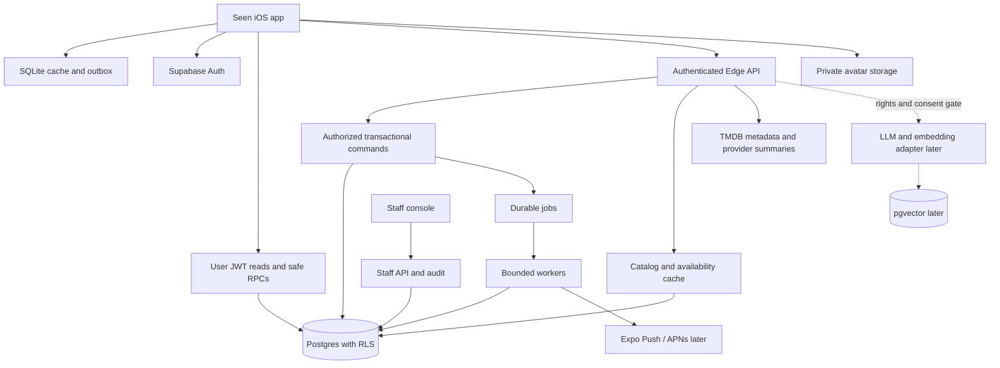
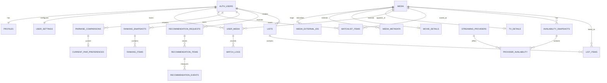

# Seen — iOS product and engineering specification

Version 1.1 · Rank Score added · October 4, 2026

**Purpose:** a buildable specification for a small team using AI coding agents. This is a development plan, not application code or an implemented system. Performance thresholds and product targets below are proposed acceptance criteria, not measured results.

**Recommended direction:** build an iPhone-first app with Expo, React Native and TypeScript; use Supabase for authentication, Postgres, storage and backend functions. Launch the core loop—find → log → compare → choose the next watch—with lightweight social discovery. Add advanced recommendations and natural-language discovery after the core loop proves useful.

**Planning assumptions:** English, United States streaming region initially, fewer than 10,000 registered users, one experienced full-time developer with intermittent design/QA support, free initial release, no advertising, no video playback or streaming-account integrations. Support iOS 17+ if the selected Expo SDK permits it; resolve the actual deployment target and Apple's required submission SDK in Phase 0. Region is explicitly selected, never inferred from location permission. Android and a full consumer web app are future work.

## Decisions at a glance

| Area | Decision |
|---|---|
| Initial client | Expo/React Native, native iOS build, portrait iPhone experience |
| Backend | Supabase; modular application services, one Postgres database |
| Metadata | TMDB through a backend adapter, subject to approved use and attribution |
| Availability | TMDB's regional provider summaries initially; licensed richer provider later |
| Personal ranking | Regularized Bradley–Terry with sentiment priors and short adaptive comparison sessions |
| Rank Score | Automatically assigned 0–10 personal preference score, displayed to one decimal alongside list position; never manually required |
| Ranking scopes | Movies and TV independently; genre/year views filter those orders |
| Logging | Liked / Fine / Disliked; date and note optional; comparison never blocks saving |
| TV unit | Whole show; watching / caught up / finished / dropped states; no episode tracker |
| V1 recommendations | Explainable metadata rules and explicit preferences; no percentage match claims |
| AI | Later structured mood parsing and semantic retrieval, gated on data-use rights |
| Social | Opt-in visibility, follow requests, public profiles, small chronological activity feed |
| Offline | Cached personal library; durable log/watchlist outbox; ranking answers require online access in V1 |
| Monetization | Defer; do not add payment infrastructure to the first build |

## Contents

A. Product overview · B. Principles · C. Personas · D. Journeys · E. Information architecture · F. Features · G. Ranking · H. Recommendations · I. AI · J. Architecture · K. Database · L. APIs and jobs · M. Auth and privacy · N. Analytics · O. Design · P. Screens · Q. Repository · R. Testing · S. Deployment · T. Roadmap · U. MVP · V. Risks · W. Agent backlog.

## A. Product overview

Seen is a personal movie and TV memory that becomes an ordered expression of taste and a useful guide to the next watch. The differentiating interaction is a small number of comparisons between titles someone knows. Reviews, social posting and exhaustive catalog management are supporting activities.

The initial audience watches at least weekly, uses multiple streaming services, and currently relies on memory, notes, scattered watchlists or friends. Serious film collectors matter, but optimizing the first release for thousands of historical logs would overwhelm new users.

The value proposition is **“Remember what you watched. Discover what you'll love.”** Success means someone can log a title quickly, recognize their own taste in the resulting list, and find a realistic option for tonight.

Primary loops:

1. **Memory:** search a title → log sentiment → automatically compare → revisit a personal ranking.
2. **Discovery:** see a relevant suggestion → understand why → save it or open availability → watch → log feedback.
3. **Social:** follow someone → discover a title through their visible activity → save/watch → eventually send a recommendation back.

Product limitations to acknowledge: Seen cannot observe Netflix playback, know that someone finished a show, or guarantee a catalog offer without an authorized integration. A watchlist add is interest, not satisfaction. A comparison measures this user's preference, not objective quality.

## B. Product principles

| Principle | Product rule | Acceptance signal |
|---|---|---|
| Fast logging | On detail, one tap opens the sheet and one sentiment tap saves | Median detail-to-save under 5 seconds in usability testing |
| Automatic placement | Save the log before opening comparisons; offer Finish later | A skipped comparison cannot undo or block a log |
| Honest uncertainty | Label inferred placements provisional; suppress unsupported percentages | No fabricated “92% match” or “87% similar” |
| Progressive setup | Taste seed, genre selection and friends can all be skipped | User reaches Home without completing a questionnaire |
| Quiet social | Publish meaningful, permitted activity; collapse batch onboarding | No public post per comparison or imported historical title |
| Explainability | Show a specific, permitted source of each recommendation | “Because you liked X” has an actual source preference |
| Privacy is compositional | A private title stays hidden in feed, ranks, counts and explanations | Cross-user access tests cover derived outputs |
| Native comfort | iOS sheets, back gestures, safe areas, Dynamic Type and VoiceOver | Core flows work with large text and assistive technology |
| Reversible actions | Undo/remove/edit without losing unrelated history | Duplicate taps and retries never duplicate logs |

Do not optimize for time spent scrolling. Measure successful watch decisions and repeated logging. Do not require dislikes during onboarding, or a fixed number of comparisons before someone can leave.

## C. User personas

| Persona | Situation and need | First success | Main risk |
|---|---|---|---|
| Casual weekly viewer | Forgets titles and wants a fast personal record | Logs last night's movie in seconds | Excessive setup and ranking homework |
| Opinionated film fan | Wants a credible Top 25 and to refine close choices | Ranking feels recognizably theirs | Arbitrary movement or hidden scoring rules |
| Time-constrained chooser | Has 90 minutes and two subscriptions | Finds an available, suitable option | Confusing movie duration with series duration |
| TV-focused viewer | Tracks shows across seasons without episode administration | Marks caught up and remembers favorites | “Watched” implying the entire series is finished |
| Trusted friend curator | Recommends selectively and values friends' taste | A friend saves or watches their suggestion | Noisy posting and unwanted messages |

## D. Core user journeys

### D1. First session

Welcome shows one sentence and a three-step illustration: Track, Rank, Discover. Allow catalog browsing before sign-in. To save, offer Sign in with Apple and email one-time code. Ask for a username, confirm US as streaming region, and optionally select providers. Offer “Pick a few you've seen and liked” with search; every selection creates a historical log with unknown watch date. Offer optional Fine/Disliked selections in a secondary step, then up to three comparisons. Show an initial list and suggestions. Friends and notification permission are deferred until context makes them useful.

### D2. Log something just watched

Search or open a poster → Log → choose Liked/Fine/Disliked → durable save and success feedback → automatically open targeted comparisons → continue until evidence assigns a provisional score → show the title in its ranking. Skip and Can’t decide continue the placement session. If no useful pairs remain, offer retry or Finish later without inventing a score. Expand Details for watched date, historical flag, rewatch, private note and visibility. Users can undo the saved log or change sentiment later.

### D3. Log a TV show

Open show → select Watching, Caught up, Finished or Dropped → optionally choose sentiment → save. Ranking requires a sentiment and explicit confirmation that the user has seen enough to judge. “Finished” is the user's status; it does not imply the network has ended production. Season totals describe catalog metadata, not progress.

### D4. Decide what to watch tonight

Open Discover → Movies → Under 2 hours → On my services → receive a short result list with truthful reason labels → inspect detail and regional availability → open the provider information link → optionally save. Unknown runtime or availability cannot pass a hard filter. If no results, offer clear ways to loosen constraints.

### D5. Refine a ranking

Open Rank → Movies or TV → see provisional titles and current list → select Refine or a specific title → compare → observe updated placement after server confirmation → use Undo if needed. Top 10/25/50 are views of the same ranking, not separate data collections.

### D6. Follow and discover

Search username → inspect visible profile → Follow or Request → read visible recent watches → add a title to watchlist. For a private profile, follow requests need approval. “Friends” means mutual accepted follows; following a public profile alone does not grant friends-only access.

### D7. Send a recommendation (after launch)

Title → Recommend → choose a mutual friend → optional short message → recipient's Inbox → Add to Watchlist / Already Seen / Not Interested. A later self-reported watch links to this referral. Sender conversion notifications require recipient permission; private activity stays private.

### D8. Reconnect after offline logging

Search cached recent titles → log or save → show Pending sync → reconnect → synchronize in order → replace local state with server-authoritative state. Conflicting edits surface a small resolution sheet; failed operations remain recoverable. Signing out warns about unsent changes and offers sync or explicit discard.

## E. Information architecture

Keep five labeled tabs: **Home, Discover, Rank, Watchlist, Profile.** Home and Discover have a prominent search affordance; search is a reusable pushed screen. Do not add a sixth social tab.

```text
Welcome / Browse / Sign in / Taste setup
Tabs
  Home: personal rails, watch-tonight picks, small friend feed
    Activity / Inbox (later)
  Discover: catalog search, genre/person pages, filters, collections
  Rank: Movies | TV; Top 10/25/50/All; comparison session
  Watchlist: Movies | TV | All; sort, filters, priority
  Profile: own summary, recent history, rankings, settings
    Other user profile / Following / Followers / Follow requests
    Lists index / List detail / List editor (later)
Shared screens: Media detail / Person credits / Search / Availability
Sheets: Log / Edit log / Filter / Compare / Report / Share
Settings: Account / Privacy / Services and region / Notifications /
          Data export / Delete account / Help / Attributions
```

Universal links resolve media, profile and later list IDs. They show only data the viewer is permitted to access. A minimal web landing/fallback page is required for links and policies; a full web app is not.

## F. Detailed feature specification

All features use common states: initial loading with stable skeletons; usable cached data while refreshing; empty with a next action; offline with explicit limitations; retryable error; forbidden/not found without private-resource disclosure. Paginated screens have initial, loading-more, end and retry states. Optimistic changes show pending status until durable local storage succeeds.

### F1. Onboarding and taste bootstrap — V1

- **Purpose/UX:** teach through the first log and a small comparison session. Recommend three to five familiar titles, but permit zero; skip optional genre and provider selection.
- **States/edges:** resumed onboarding, cancelled Apple auth, expired email code, unavailable username, no seed selections, only one title of a kind. Never compare titles the user has not marked seen.
- **Data:** profile, private settings, selected subscriptions, user-media state, historical logs, comparisons, onboarding checkpoint.
- **Dependencies:** auth, catalog, log transaction, ranking. Complete setup remains usable when ranking is temporarily unavailable.
- **Future:** import historical ratings through licensed/user-provided files; optional friend invitations. No contacts upload in V1.

### F2. Catalog search and people — V1

- **Purpose/UX:** unified Movies/TV results with year and format badge; separate People tab for actors/directors. Debounce 250 ms, cancel superseded requests, keep a small local recent-query list.
- **States/edges:** transliteration, alternate title, remakes, identical film/TV IDs, adult exclusion, missing image, no results, upstream outage. A title result opens detail even with incomplete metadata.
- **Data:** normalized media IDs, provider IDs, titles, localized metadata, people and credits. Search genre/year through structured filters, not fragile text parsing.
- **Dependencies:** TMDB proxy and server cache; all API credentials remain server-side.
- **Future:** natural-language search and broader localization.

### F3. Media details and metadata — V1

- **Purpose/UX:** title identity, personal actions, where to watch, and reasons to care. Artwork leads; long synopsis is collapsed.
- **States/edges:** unreleased/cancelled title, no runtime, changing TV counts, missing provider data, deleted upstream title, a person with multiple credit roles. Preserve user history if metadata disappears.
- **Data:** base media, movie/TV details, genres, credits, videos, availability, user-media, authorized friend aggregates.
- **Dependencies:** hydrated catalog cache and user summary APIs. Trailers open an official source link; Seen does not host video.
- **Future:** licensed external scores, seasons and episodes. TMDB vote average is labeled as TMDB, never presented as Seen's own score.

### F4. Logging and personal library — V1

- **Purpose/UX:** sentiment saves immediately. Liked/Fine/Disliked are the only rating choices; no Loved tier. A private note is optional, capped at 280 characters.
- **States/edges:** initial watch, rewatch, historical watch with unknown date, TV status without sentiment, future date rejected, duplicate request, edit, delete and undo. Watching status alone is not a completed watch event.
- **Data:** `watch_logs` records events; `user_media` records current relationship and current opinion. Rewatch adds an event but does not count as another independent preference.
- **Dependencies:** atomic mutation, idempotency, local outbox. Logging a completed movie removes it from watchlist in the same transaction; for TV, first start removes it. Offer undo; users may manually re-add for rewatch.
- **Future:** richer notes and import. Do not build public reviews/comments for launch.

### F5. Ranking — V1

- **Purpose/UX:** build a list without asking users to assign precise ratings. Show an automatically assigned **Rank Score** such as 9.1 alongside position #4. Three comparisons suggested per visit; never demand ten comparisons to save one item.
- **States/edges:** no eligible titles, one title, disconnected evidence, ties, skip, changed opinion, deleted logs, conflicting simultaneous edits and pending recalculation.
- **Data:** comparison history, opinion revisions, ranking inputs, versioned snapshot and derived Rank Score/scale version. Algorithm, eligibility and score semantics are defined in G.
- **Dependencies:** current sentiments, eligible scopes, comparison service. Rankings are server-authoritative.
- **Future:** explicit cross-format ranking, richer uncertainty model and offline comparison packs.

### F6. Home and Discover — V1

- **Purpose/UX:** Home helps resume a task; Discover helps browse. V1 Home has Continue ranking, Watch tonight, Because you liked, and Friends watched. V1 Discover has For you, Popular, New releases, genres and creators.
- **States/edges:** cold start, no subscriptions, no unseen candidates, partially unavailable services, refreshing taste profile. Display editorial/popular labels honestly when personalization is sparse.
- **Data:** requests, candidates, recommendation items/reasons, preference revision and visible friend signals.
- **Dependencies:** catalog cache, V1 rules engine, availability when filtered.
- **Future:** similar-taste trends, hidden gems, semantic discovery. “New releases” is release-date based; “new on streaming” is a different feature requiring the relevant feed.

### F7. Watchlist — V1

- **Purpose/UX:** one default watchlist; toggle save anywhere. Sort by date added, priority, release date or title. Filters: movie/TV, genre, availability and movie runtime.
- **States/edges:** empty, unavailable, removed title, duplicate add, add/remove race, region change, stale offer. Unknown runtime is excluded from an active maximum-runtime filter.
- **Data:** a unique user/media watchlist row, priority 0–2, source and optional originating recommendation item, added timestamp and tombstone.
- **Dependencies:** atomic save transaction and outbox; provider cache for availability.
- **Future:** predicted match sorting, friends-loved section and licensed leaving-soon alerts.

### F8. Streaming availability — V1 summaries; richer data later

- **Purpose/UX:** show subscription, free/ad-supported, rent and buy separately for the selected region. Label subscription matches “On your selected services” unless plan-level entitlement is verified.
- **States/edges:** no known offers, provider request failure, stale snapshot, region unsupported, channel add-on vs parent subscription, partial TV seasons, unknown quality/price. No results is not proof a title is unavailable everywhere.
- **Data:** provider mapping, regional offer type, scope, source link, checked timestamp, refresh status and optional contract-supplied dates/prices.
- **Dependencies:** approved TMDB/JustWatch usage. See L for researched provider strategy.
- **Future:** licensed direct links, dates and season-level offers. Never infer expiry dates from disappearance or let an LLM invent them.

### F9. Profiles, follows and activity — V1 minimal social

- **Purpose/UX:** display name, username, avatar, short bio, visible Top 10 and recent watches. Follow/search users, approve requests, block and report. Feed is cursor-paginated, chronological, with at most one aggregate item per user's batch.
- **States/edges:** private profile, pending request, no common watches, blocked either direction, deactivated user, revoked follow, content made private after publication.
- **Data:** profile visibility, follows, blocks, safe profile projection and activity references. Do not store copied private notes in feed payloads.
- **Dependencies:** RLS, report queue, basic moderation and cache invalidation. Onboarding does not generate a flood of public activity.
- **Future:** Taste Match, lists and direct recommendations. V1 feed excludes comparisons and watchlist adds by default.

### F10. Taste Match — after launch

- **Purpose/UX:** explain agreement using mutually visible shared titles. Start with “Similar taste · 14 shared titles,” then a transparent index only if research justifies it.
- **States/edges:** too few shared titles, ties, conflicting preferences, private histories and narrow genre overlap. Never imply population-wide certainty from three titles.
- **Data/dependencies:** visibility-safe overlap, explicit sentiments and common-title order; versioned similarity job described in H.
- **Future:** opt-in collaborative recommendations with support thresholds. A similarity index is not a predicted enjoyment probability.

### F11. Friend recommendations and notifications — after launch

- **Purpose/UX:** recommendation inbox, optional 280-character message, three receiver actions. Only mutual friends can send by default; no unrestricted direct messaging.
- **States/edges:** duplicate pending recommendation, sender blocked, title already seen, private watch, revoked permission, denied push permission, deleted message. “Not interested” declines this referral; broader suppression is a separate explicit choice.
- **Data:** sender/receiver/media, status, source log attribution, preferences, delivery attempts and device tokens.
- **Dependencies:** social permissions, moderation, in-app inbox, APNs delivery through Expo. Inbox is canonical; push is best effort.
- **Future:** new-season and availability notices where source data supports them. Ask notification permission at first relevant intent, not on first launch.

### F12. Custom lists — after launch

- **Purpose/UX:** named ordered collections with description, add/remove/reorder and public/friends/private visibility. List membership is independent of watched status.
- **States/edges:** empty list, duplicate title, concurrent reorder, deleted title, changed visibility, inaccessible share link.
- **Data:** list owner, version, visibility, ordered items with unique positions. Owner-only edits initially.
- **Dependencies:** catalog IDs, visibility evaluator and universal links.
- **Future:** collaborative lists and editorial curation; no collaborative editing or list comments in V1.

### F13. Settings, export and deletion — V1

- **Purpose/UX:** control profile/history/watchlist visibility separately, region, providers and analytics choice; export data and delete account inside the app.
- **States/edges:** queued export, expiring download, recent-auth requirement, queued deletion, no connectivity, pending local changes. Reauthentication protects destructive actions without a support-email hurdle.
- **Data:** private settings, export/deletion job, audit status and storage objects.
- **Dependencies:** authorization, revocation and purge jobs. Export contains the user's own logs, state, comparisons, watchlist and later lists; not other users' private data or a bulk licensed catalog.
- **Future:** imports and more regional controls.

### F14. Internal operations — V1 essentials

- **Purpose/UX:** tiny staff console for user account status, reports, metadata mapping errors, job failures, recommendation reason inspection, vendor usage and feature flags.
- **States/edges:** unauthorized staff session, retrying job, quarantined avatar, report resolution and revoked access.
- **Data/dependencies:** staff role, audit log, job states and redacted operational metrics. Do not give staff a browser-wide service-role token or default access to private notes.
- **Future:** richer experiments and support workflows; do not build a generalized CMS.

## G. Ranking system specification

### G1. Algorithm decision

Use a **regularized Bradley–Terry model per user and format**, implemented as a small pure TypeScript module. Persist answers as canonical evidence; scores and positions are rebuildable projections. Use an insertion-inspired picker to select a few useful questions, without treating binary-search bounds as proven preference relations.

Elo is an acceptable prototype, but its usual sequential updates depend on answer order and step size. A deterministic fit over current answers makes edits and undo easier to reason about. TrueSkill offers richer uncertainty and draw inference but adds unnecessary machinery for this launch. Strict insertion sort assumes a consistent total order and struggles with ambiguous/cyclic preferences. Bradley–Terry supplies an explicit objective with a modest implementation. Sparse comparison graphs still limit ranking interpretation; regularization cannot create missing evidence. These tradeoffs are supported by the [Bradley–Terry sparse-data research](https://proceedings.mlr.press/v162/bong22a.html), [prior modeling discussion](https://arxiv.org/abs/1712.05311), and [original TrueSkill report](https://www.microsoft.com/en-us/research/publication/trueskilltm-a-bayesian-skill-rating-system-2/).

### G2. Eligibility and answer semantics

A movie is eligible when the user marked it seen and selected sentiment. TV is eligible with sentiment plus “I've seen enough to rank it”; watching/dropped alone is insufficient. A watchlisted/unseen title never enters comparisons. Rewatching does not add preference weight. Historical logs can be eligible without a known watch date.

| UI answer | Stored outcome | Effect |
|---|---|---|
| Title A | `a_wins` | y = 1 in canonical A/B orientation |
| Title B | `b_wins` | y = 0 |
| About the same | `similar` | y = 0.5; soft evidence that scores should be close |
| Can't decide | `undecided` | No preference update; pair cooldown 30 days |
| Skip | `skip` | No preference update; pair cooldown 7 days |
| Remove my answer | `retract` | Remove current pair evidence |

“About the same” is not a guaranteed shared ordinal rank. Other answers may separate the titles. Do not conflate it with uncertainty. A skip during reconsideration preserves the previous explicit answer. Undo retracts/supersedes an answer; it does not submit an opposite vote.

### G3. Objective and solver

For eligible title i, initialize the sentiment prior `mu_i` to +1 for Liked, 0 for Fine, −1 for Disliked. These are internal starting values, not user-facing scores. Let `s_i` be its latent preference score:

```text
p(i preferred to j) = sigmoid(s_i - s_j)

L(s) = Σ_active_pairs [softplus(s_i-s_j) - y_ij(s_i-s_j)]
       + (λ/2) Σ_titles (s_i-mu_i)²

λ = 0.25 initially
gradient_i += sigmoid(s_i-s_j) - y_ij
gradient_j -= sigmoid(s_i-s_j) - y_ij
gradient_i += λ(s_i-mu_i)
```

There is one active observation per unordered pair in the current opinion revisions. Weight each observation equally in V1. Positive regularization keeps unbeaten titles and disconnected components finite and makes the objective strictly convex. Sentiment is a soft prior: a Fine title can move above a Liked title through comparisons.

Use stable sigmoid/softplus and deterministic full-batch gradient descent with Armijo backtracking. Canonicalize title/edge iteration order and initialize from prior means for reproducibility. Starting solver configuration: maximum 300 iterations, maximum absolute gradient tolerance 1e−5, backtracking factor 0.5, Armijo constant 1e−4. Validate these constants on fixtures and realistic workloads; keep them in `model_version`, not scattered across functions.

Each objective/gradient pass is O(n+m) for n titles and m active pairs. Never allocate an n×n matrix. A user with thousands of titles is feasible without a separate ML platform, but benchmark the actual runtime. Hosted Edge Functions have a CPU limit, so large fits must use a bounded worker or move to a small dedicated job runtime if necessary. [Supabase runtime limits](https://supabase.com/docs/guides/functions/limits).

If a fit fails, is nonfinite or does not converge, retain the previous complete snapshot and queue a retry. Do not expose a half-written or partial ranking.

### G4. Comparison selection

After any Liked/Fine/Disliked choice, automatically open a placement session for that title. Persist the log first. Placement has no three-question cap: skips and undecided answers continue until a scored answer is saved, then open the appropriate ranking. Prefer already ranked titles sharing genres, then nearby personal scores; keep formats separate. General refinement sessions retain a three-question budget. A provisional score is not a promise of exact placement among all titles. With fewer than two eligible titles, keep the watch saved and unscored, and explain how to create another pair. TV sentiment opens the modal even before eligibility confirmation; ask for explicit seen-enough confirmation there.

New title placement starts near the midpoint of its sentiment neighborhood in the current placed list. Following a clear preference, narrow the session's candidate interval and ask another midpoint. For a similar answer, contradiction or stale bracket, switch to nearby candidates. If no placed items exist, compare two eligible unplaced titles of the same format. Rebuild brackets on session resume.

General refinement picks an explicitly requested title first, then an unplaced recent title, then one with few opponents or ambiguous neighbors. Candidate pool: up to 12 nearest scores, eight quantile anchors and four nearby titles in other graph components. Exclude self, unseen, wrong-format, already-active and cooldown pairs unless the user requested reconsideration.

Use a versioned heuristic, not a claim of optimal information gain:

```text
q = 4*p*(1-p)
coverage = 0.5/(1+opponents_i) + 0.5/(1+opponents_j)
priority = 0.65*q + 0.25*coverage + 0.10*top10_boundary_relevance
```

Every fifth served question prefers an eligible bridge between disconnected components, choosing the smallest score gap. Randomize presentation side; keep canonical stored orientation. Retain picker reason and session seed for debugging. “No useful comparisons right now” is a successful end state.

### G5. Positions, confidence and opinion changes

Uncompared titles appear in **Not yet placed**, sorted by sentiment/recent log, with no precise rank. Compared titles receive a position in the approximate fitted order. Sort by raw score, using media ID only for exact numerical equality. Do not round scores before sorting or publish internal numeric scores.

Evidence labels:

- **Unplaced:** zero current unique opponents.
- **Provisional:** fewer than five opponents, disconnected from the main compared component, or a near-equal adjacent score.
- **Refined:** at least five opponents, connected, and no near-equal neighbor. This describes evidence coverage, not calibrated certainty.

Start near-equal detection at an absolute score gap below 0.15, then validate in research. Show “Based on 4 comparisons”; do not show confidence percentages. Cycles such as A>B, B>C, C>A are valid; the model compromises without rejecting the user.

Changing sentiment or choosing “My opinion changed” increments `user_media.opinion_revision` and invalidates current comparisons touching that title. Preserve historical events for owner export until retention/deletion requires purge. A rewatch, note edit or date correction does not reset opinion. Changing one A/B answer supersedes only that pair. Undo restores prior evidence only when its endpoint opinion revisions still match and no conflicting edit intervened.

Movies and TV have separate fits. Top 10/25/50, genre and release-year views filter the canonical format list; they do not fit additional models. Label watched-year filters separately. An overall ranking is deferred because independently fitted movie/TV scores are not calibrated against one another; it would need an explicit scope with cross-format evidence.

### G5a. User-facing Rank Score

**Product decision:** every placed title receives a **Rank Score from 0.0 to 10.0**, displayed to one decimal. The ordinal position and score are distinct: **#4** is list position; **9.1** is the title's assigned personal preference score. Users still log Liked/Fine/Disliked and answer comparisons; they do not enter or edit the number directly.

Use a fixed monotonic display transform of the fitted Bradley–Terry score, rather than a percentile of library size or a calculation from the currently filtered position:

```text
score_scale_version = "bt-logistic-10-v1"
display_value = 10 * sigmoid(s_i)
rank_score_tenths = clamp(floor(10 * display_value + 0.5), 0, 100)
rank_score = rank_score_tenths / 10
```

This is a designed personal preference index, not a calibrated enjoyment probability, external critic rating or statistical confidence. The fixed prior/regularization and transform are versioned together; do not dynamically stretch the highest title to 10 or lowest to 0. Adding an unrelated title or changing a filter does not itself rescale existing scores. Preference changes/comparisons can change the fitted score and assigned number. Score values are meaningful within one user's movie or TV scope, not for comparing people or merging independent formats.

Display rules:

- Ranked rows retain ordinal on the left and show a compact right-aligned score, with **Rank Score** as the column/legend label and a tooltip explaining the 0–10 scale. Example sample row: `#4  Dune: Part Two  9.1`.
- Title detail and owner-profile rank previews show **Your score 9.1 / 10**, position and evidence label together. A provisional placement still has a score, visibly marked **Provisional**.
- Unplaced titles have `rank_score=null`, rendered as an em dash or **Not yet scored**. Do not turn a sentiment prior alone into a supposedly ranked number; unlogged recommendations never have the viewer's personal score.
- Keep both titles' scores hidden during the head-to-head question to reduce anchoring. A completed session may show the accepted resulting score after the new snapshot is published.
- Sort by the unrounded latent score. Two titles may both display 9.1 while occupying different positions; one-decimal rounding is not evidence of a true tie.
- Use the same snapshot/scale version across list, detail and profile. Pending recomputation retains the last confirmed score with **Updating**; reset/removal with no active evidence clears the confirmed rank and score. No optimistic fabricated numeric result.
- A visible friend's title may show **Sarah's score 8.8**, explicitly attributed to Sarah. Current profile/title/block permissions gate the derived number exactly as they gate sentiment. It is not a global score or the viewer's predicted score.
- Safe social projections may disclose this deliberately user-facing score for visible titles, while continuing to omit raw latent values, hidden opponent IDs, private totals and personal absolute positions. Filtered shared ranks renumber positions but preserve the visible title's score; do not calculate a new percentile that reveals hidden library size.

Keep internal `latent_score` separate from nullable display `rank_score`; persist the display value in the same immutable snapshot for consistent clients. A new scale version requires a complete snapshot recompute, an explicit rollout and tests; never silently reinterpret an older cached score.

Required score tests: finite/bounded values, deterministic one-decimal formatting, monotonicity, no re-scaling on genre/year/Top-limit filters, identical values across surfaces, same displayed score with different underlying order, null unplaced/reset scores, skip/rewatch invariance, snapshot/retry consistency, and denied scores for private/blocked titles. Unit fixtures may test the display transform; wireframe numbers are illustrative sample preferences, not claimed model outputs from actual user data.

### G6. Transaction and publication contract

```text
submitComparison(command):
  authenticate actor; validate offered pair/session and bounded input
  transaction:
    return existing receipt for identical operation_id + payload hash
    lock scope state and current pair
    validate media kind, eligibility and endpoint opinion revisions
    check expected_pair_revision for a changed existing answer
    append canonical event; update current preference only when decisive/similar/retract
    bump input_revision only when preference inputs change
    enqueue/coalesce ranking job; store mutation receipt atomically
  return accepted + previous snapshot revision + updating flag

recompute(user, scope, requested_revision):
  read consistent current inputs
  fit and verify convergence
  derive positions, Rank Scores, opponent counts and component/evidence flags
  transaction:
    lock scope state
    publish complete snapshot only if input_revision still matches
    otherwise discard stale result and queue latest revision
```

Scope writes use one consistent lock order to avoid deadlocks. Snapshot IDs let readers see an entire old or new ranking, never mixed rows. Keep at most the newest two snapshots during normal operation; canonical events allow rebuilds. Response includes snapshot ID, input revision, model version, computed time and `recompute_pending`.

For another viewer, filter by current visibility/block rules first, sort, renumber densely, then take ten. Label it **Top shared titles**. Never return personal absolute positions, private denominators, hidden opponents, latent scores or rank-change messages that reveal hidden titles.

Include `rank_score` and `score_scale_version` in authorized ranked-item DTOs; raw `latent_score` remains internal. Shared-title scores obey G5a and current visibility rules.

## H. Recommendation architecture

### H1. V1: candidate generation, filters, explainable scoring

Separate recommendation services from ranking. Ranking orders titles someone knows; recommendations select unseen candidates. V1 requires no model training or LLM calls.

Build a bounded candidate pool, typically 200–500 unique titles, from cached TMDB related titles for up to five liked seeds, genre/creator discovery, popular/new-release catalogs, and currently visible friend likes. Deduplicate by internal media ID. Fetch only a few upstream pages per source under a shared request budget.

Apply hard constraints first: media format, adult exclusion, known runtime within limit, release state, selected country, and requested available-provider match. Exclude seen, explicitly dismissed and currently dropped titles by default; provide an intentional rewatch mode later. Never relax constraints silently. Filter unavailable metadata to “unknown,” rather than assuming it passes.

Build preference weights from current explicit sentiment and current ranked order. Liked contributes positively; Disliked negatively; Fine is neutral. Use genre, selected creators and credited cast with caps so one prolific actor cannot dominate. Normalize contributions per title; repeated rewatches do not multiply taste weight. Sparse-ranking users still get value from sentiment.

Initial versioned score, with each feature bounded to [0,1]:

```text
score = .35 genre_affinity + .25 liked_seed_similarity
      + .15 creator_cast_affinity + .10 visible_friend_support
      + .10 selected_service_match + .05 quality_popularity_prior
      - dislike_penalty - repetition_penalty
```

Renormalize available positive weights when a feature is missing. Record feature values/reason codes privately for inspection. These weights are hypotheses, not trained coefficients. Popularity and vote count are weak discovery aids, not personal enjoyment evidence. Re-rank for variety: cap repeated franchises and creators, reserve roughly 20% of slots for suitable exploration, and mix sources. Use a deterministic request seed for repeatable debugging.

Reason templates use actual evidence: “Because you liked Zodiac,” “From a director you like,” “Two friends liked this,” or “Popular this week.” A friend reason must use presently visible data. Low-signal users get “Popular picks to get started.” Suppress “Predicted match: 92%” until a future model is calibrated against a defined outcome.

Cache personal results by `(user, preference_revision, region, provider_revision, filters, algorithm_version)` for up to six hours; filter freshness and permissions again when serving. Refresh after accepted feedback, region/provider changes or catalog expiry. A stored candidate may no longer be eligible at read time.

### H2. V2: taste similarity and collaborative candidates

Add only after enough real overlap exists. Start with a scheduled item-item co-like/co-watch model and explicit-neighbor recommendations, before matrix factorization. Exclude opted-out/private cross-user evidence; document whether deidentified learning is a separate opt-in. Blocked users cannot appear as recommendation sources.

Taste Match uses mutual visible titles. Require at least ten shared titles before displaying a numeric index. Compute sentiment agreement and concordance over comparable common-title pairs; show overlap and range of genres, not merely a flattering percentage. Example implementation:

```text
sentiment_similarity = mean(1 - abs(a_sentiment-b_sentiment)/2)
order_similarity = (concordant_pairs + .5*tied_pairs) / comparable_pairs
raw = .6*sentiment_similarity + .4*order_similarity
weight = shared_titles / (shared_titles + 20)
similarity_index = 100 * (weight*raw + (1-weight)*.5)
```

If order evidence is unavailable, use sentiment alone and label it accordingly. This shrinkage-weighted index is agreement, not probability of liking the same future film; constants require validation. Pair sampling is bounded for large overlaps. Do not compare full-list absolute positions across differently sized libraries.

Generate collaborative candidates from sufficiently supported neighboring tastes; require a minimum source count and shrink sparse counts. Blend with content rules to preserve cold-start quality and diversity. Start daily batch updates; event-stream infrastructure is unnecessary. Enable only if temporal holdout evaluation and controlled rollout improve save/watch/satisfaction metrics.

### H3. V3: licensed semantic retrieval and learning to rank

Create versioned embeddings from metadata that the supplier permits processing. Combine semantic candidates, item-item candidates, friend candidates and content candidates through reciprocal rank fusion or a measured learned reranker. Keep runtime, country and availability constraints deterministic.

A personal semantic profile can combine liked-title vectors and selected taste attributes. Minimize raw watch-history sharing; compute the profile in Seen's backend. Vector similarity is not enjoyment probability. `pgvector` supports exact and approximate search; begin with exact retrieval over the bounded catalog and add HNSW only when measured latency calls for it. Filtered approximate retrieval needs recall testing. [pgvector documentation](https://github.com/pgvector/pgvector).

Do not train a personalized model for every user. Maintain model versions, feature definitions, experiment assignment and reproducible recommendation records. Advance to calibrated predicted match only with sufficient outcome data, held-out calibration, support labels and documented limitations.

## I. AI architecture

### I1. Rights and scope gate

Do not assume API access licenses embeddings, metadata enrichment or LLM processing. Indexed TMDB terms contain broad ML/AI-use restrictions; direct retrieval of the full terms was blocked during this research. Confirm current signed terms, caching, commercial use and the intended recommendation/AI workflow directly with TMDB before enabling any AI connected to that data. This uncertainty is a Phase 0 decision, not a reason to stop planning. [TMDB API terms](https://www.themoviedb.org/api-terms-of-use?language=en-CA).

Start without AI. Later use an LLM for interpreting a user's mood and possibly rewriting grounded explanations. Never use it for personal ranking, authorization, availability truth, invented title metadata or unbounded catalog generation.

### I2. Mood-search pipeline

1. Accept a bounded prompt, capped at 500 characters, after the user opts into the AI feature and understands third-party processing.
2. Parse to a strict JSON schema using a backend-only model call; use the Responses API with Structured Outputs. Schema adherence does not make interpreted facts correct, so validate all values and references. Handle refusals, incomplete responses and timeout. [Official OpenAI Structured Outputs documentation](https://developers.openai.com/api/docs/guides/structured-outputs).
3. Resolve mentioned titles against Seen's catalog; ask a small inline disambiguation question if a reference has multiple matches. Do not let the model invent internal IDs or SQL.
4. Convert constraints to allowlisted query/filter operations. Apply hard constraints and exclude seen/dismissed candidates.
5. Retrieve content and, when rights permit, semantic candidates; score with the user's private preference features on Seen's server.
6. Return poster results, reason labels and editable filter chips. Explain exclusions and offer explicit relaxation when no result satisfies the constraints.

Example contract:

```text
MoodIntent {
  schema_version: 1
  media_kind: movie | tv | either
  runtime: { max_minutes: integer|null, unit: movie|episode|series|null }
  genres_include: allowed_genre_ids[]
  genres_exclude: allowed_genre_ids[]
  tone_include: allowed_tone_tags[]
  tone_exclude: allowed_tone_tags[]
  reference_title_queries: string[]
  release_year_min: integer|null
  release_year_max: integer|null
  subscription_only: boolean
  ambiguity: string|null
}
```

“I have 90 minutes” defaults to movies. “Shorter than The Americans” requires clarification between shorter episodes and shorter total series commitment. A TV episode estimate never proves the full series fits the time budget. “Not depressing” is a subjective tone preference; surface a qualified label rather than a guarantee.

### I3. Embeddings and semantic tags

When licensed, embed a curated text document containing title identity, synopsis and explicitly sourced genres/keywords/tone tags. Use `text-embedding-3-small`, 1,536 dimensions, as the initial documented configuration; pin the model/dimensions per embedding version and recheck availability at implementation. Query and content vectors must use the same version. [Official OpenAI embeddings guide](https://developers.openai.com/api/docs/guides/embeddings).

Deduplicate by normalized input hash; rebuild changed documents; preserve provenance and confidence for AI-generated tags. Keep inferred tags separate from factual metadata. Do not re-embed the entire catalog on every request. No private user note is sent to the model by default.

### I4. Cost, failure and trust boundaries

Configure model IDs server-side, token ceilings, a per-user quota, a global daily spending cutoff and a feature kill switch. Starting product quota: ten mood queries/user/day, subject to actual pricing and abuse tests. Timeout at eight seconds and return deterministic filter suggestions; do not silently invent results. Cache parsed nonpersonal intents briefly by input hash; personalize after parsing.

The model gets no arbitrary HTTP tools, database credentials or user-write tools. Treat prompts and metadata as untrusted text. Prefer reason templates; if an LLM rewrites a reason, supply only verified permitted facts, validate title references and forbid unsupported availability/score claims. Log model version, prompt-template version, latency and usage without retaining raw prompts by default.

## J. Technical architecture

### J1. Recommended stack

| Layer | Default | Reason and boundary |
|---|---|---|
| iOS app | Expo + React Native + TypeScript, stable compatible versions pinned in Phase 0 | Rapid iteration and reusable domain/client code; real native development builds |
| Navigation | Expo Router with native stacks and five tabs | Typed routes, deep links, native sheets/back behavior |
| UI | React Native primitives, small owned component library, Reanimated for limited motion | Avoid a large theme framework and make accessibility explicit |
| Data fetching | TanStack Query + typed Supabase/client service wrappers | Cache, request cancellation and mutation invalidation |
| Local state | Component state; a small Zustand store only for transient cross-screen session state | Avoid a global copy of server data |
| Durable local data | expo-sqlite; secure auth adapter using SecureStore | Explicit offline outbox; credentials separated from content cache |
| Images | expo-image + source-sized CDN URLs | Memory/disk caching and stable placeholders |
| Auth | Supabase Auth, native Apple sign-in and email OTP | iOS-friendly, avoids passwords in first release |
| Data | Supabase Postgres, RLS and narrowly scoped RPCs | Relational transactions suit rankings, privacy and social data |
| External I/O | Supabase Edge Functions in TypeScript | Keys, normalization, rate limits and cache coordination |
| Jobs | Postgres-backed queue, scheduled worker, leases/retries | Durable background work; no Kafka/Redis requirement |
| User uploads | Supabase private Storage bucket for avatars | Policy-controlled access, processed thumbnails |
| Diagnostics | Sentry or equivalent crash/error tool, structured redacted logs | Release regressions and operational failures |
| Product analytics | First-party event table + scheduled aggregates initially | Low cost and explicit data minimization |
| Build/distribution | EAS development/build/submit; TestFlight; GitHub Actions | Repeatable native releases |
| Later AI | OpenAI behind provider adapter; pgvector when licensed | Replaceable integration, no client keys |
| Admin | Small separate Next.js internal app after core services | Browser convenience; no duplicate consumer app |

Expo Go is insufficient for validating production auth and native integrations; use a [development build](https://docs.expo.dev/develop/development-builds/introduction/). Keep the minimum runtime OS distinct from the SDK used for App Store submission.

**Why this over alternatives:** SwiftUI would be the default for a permanently iOS-only product with a strong Swift team. For this brief's small team, TypeScript-based agents and eventual Android ambition, Expo reduces duplicated work while retaining native interfaces. Flutter is viable but adds Dart to this proposed stack without a decisive advantage. Next.js/React alone produces a website, so it is not the iOS client. Later web can share schemas, API clients and domain logic; assume some screen/UI code will be separate rather than promising universal pixel-for-pixel reuse.

Supabase is appropriate below 10,000 users provided queries, indexes and privacy policies are designed carefully. It is not an automatic recommendation engine, offline sync system or application-level abuse shield. Start with one database and a modular service layer; add a dedicated worker only when CPU or throughput requires it.

### J2. System diagram



### J3. iOS performance and offline contract

Targets on an agreed midrange supported iPhone: interaction feedback under 100 ms; cached personal screen usable within 300 ms; warm cached API p95 under 500 ms; search first useful results under 1.5 seconds on normal network; fewer than 1% of sessions with a crash and preferably crash-free sessions ≥99.5%. Cold upstream calls are measured separately and never disguised as cache latency.

Paginate 30 items per request with a cap of 50. Use virtualized lists, sized posters, stable aspect ratios, limited prefetch of the next visible rail and a bounded image cache. Do not download original-size backdrops to render tiny cards. Batch title hydration and user summaries; avoid per-poster network calls.

V1 offline supports the owner's recently cached library/rank display, cached title details, new watch events and desired-state watchlist changes. Discovery, social, privacy changes, auth and comparison submission require connectivity. SQLite stores user-scoped commands; SecureStore stores credentials. [Expo SQLite](https://docs.expo.dev/versions/latest/sdk/sqlite/) and [SecureStore](https://docs.expo.dev/versions/latest/sdk/securestore/).

Outbox states are Saved on device, Syncing, Synced, Needs attention and Failed. Persist before acknowledging a local save. Flush on foreground, connectivity recovery and explicit retry. iOS background execution is opportunistic, so never promise timely sync while the app is closed.

Command envelope: `{operation_id, schema_version, kind, target_id, base_revision, payload}`. Bind idempotency to authenticated actor plus operation ID plus canonical payload hash. Apply receipt, state change and resulting job/event in one transaction. Retry returns the original accepted result; reused IDs with different payloads fail. Serialize dependent commands for each logical target. Use server revisions for order, not device timestamps.

Watchlist writes are `present=true/false`, not toggles. Retain removed rows as tombstones. Stale add/remove returns current state and a conflict; applying the user's choice creates a new command with the current revision. For a stale log-plus-sentiment command, do not silently overwrite newer opinion: show the conflict and offer to save the watch event without updating sentiment, using a new operation ID. Unrelated target edits can merge.

Outbox replay is supported for 30 days; receipts and tombstones retained at least 90 days, unless account deletion requires purge. Older operations need reconciliation. Logout/account switch never replays one user's data as another. Warn about unsent changes and require explicit sync/discard. Clear personal caches on sign-out. Device cache protection and backups must be tested; do not assume SQLite is encrypted by default.

## K. Database schema

### K1. Modeling decision and conventions

Use one stable `media` identity with movie/TV detail tables. Logging, comparisons, lists and recommendations then share one foreign key. Separate full movie and TV tables would duplicate these relationships or require polymorphic keys without reliable referential integrity. Subtype tables retain explicit runtime/episode semantics. Documentaries, limited series and specials start as classifications, not separate identity systems.

This section is a **schema contract for migrations**, not an executable migration. Coding agents must turn it into versioned SQL, constraints, grants, RLS and seed fixtures in the order specified by W. Do not create every future table in Phase 0.

Conventions:

- IDs are UUIDs generated server-side, except client-generated immutable watch-event IDs and operation IDs. Supplier IDs are text/bigint in namespaced mapping tables, never primary keys.
- In the dictionaries below, an unqualified `id` is the UUID primary key; foreign-key IDs are UUIDs. Fields ending `_at`, `_until` when referring to leases, or `_after` when referring to job scheduling are `timestamptz`; availability start/end dates are explicitly `date`. `version`, `*_revision` and sequence counters are `bigint`. Each referenced parent and its deletion behavior must be declared explicitly in the migration.
- `C/U` means `created_at timestamptz not null default now()` and `updated_at timestamptz not null default now()`, maintained by a trigger. Event tables use immutable `created_at` only.
- `D` means nullable `deleted_at timestamptz`, used for recoverable user mutations/sync tombstones. Soft deletion never replaces eventual account/content erasure.
- `user_id` references `auth.users(id) ON DELETE CASCADE`; owner-bound child rows cascade on owner deletion. Media references use `ON DELETE RESTRICT` unless a subtype/join is being removed. Supplier disappearance tombstones metadata rather than deleting the stable identity.
- All unspecified columns below are NOT NULL; `?` indicates nullable. Counts/revisions are nonnegative integers; revisions increment on accepted state changes, not reads/retries. JSON is allowed for bounded diagnostics or source payloads, not core relationships.
- Define checked text values for sentiment `liked|fine|disliked`, content visibility `public|friends|private`, media kind `movie|tv`, watch status `seen|watching|caught_up|finished|dropped`, ranking scope `movie|tv`. Database checks and server validation enforce valid format/status combinations.
- User-visible raw owner tables are in `public` with restricted grants and owner RLS; sensitive internals are in unexposed `private`. Other-user data is served through authorized safe projections, not unrestricted raw-row reads.

### K2. Identity and settings — V1

| Table | Columns | Constraints/indexes and purpose |
|---|---|---|
| `profiles` | `user_id PK`, `username text`, `display_name text`, `bio text default ''`, `avatar_asset_id uuid?`, `visibility text default 'private'`, `account_state text default 'active'`, `version bigint default 1`, C/U | Case-insensitive unique username; length 3–24 and allowlisted characters; display name 1–50, bio ≤160. Profile visibility public/private; private account gates its detailed projection on an accepted follow. Do not expose email. Index normalized username for prefix search. |
| `user_settings` | `user_id PK`, `region char(2) default 'US'`, `locale text default 'en-US'`, `history_visibility text default 'private'`, `watchlist_visibility text default 'private'`, `analytics_opt_in boolean default false`, `collaborative_opt_in boolean default false`, `ai_opt_in boolean default false`, `onboarding_step text`, `onboarding_completed_at timestamptz?`, `version bigint`, C/U | Valid region from supported-region catalog; owner-only read/write. |
| `user_genre_preferences` | `user_id`, `genre_id FK genres`, `preference smallint`, C/U | Composite PK `(user_id,genre_id)`; preference −1 or +1; explicit selections, separate from inferred features. |
| `user_person_preferences` | `user_id`, `person_id FK people`, `preference smallint`, C/U | Composite PK `(user_id,person_id)`; preference −1 or +1. |
| `avatar_assets` | `id PK`, `user_id`, `storage_path text`, `thumbnail_path text?`, `status text`, `mime_type text`, `byte_size bigint`, C/U, D | Owner index; status uploaded/processing/approved/rejected. Storage paths unique; avatar FK set null on asset deletion. Signed delivery only after approval. |

### K3. Catalog and availability — V1

| Table | Columns | Constraints/indexes and purpose |
|---|---|---|
| `media` | `id PK`, `kind text`, `classification text?`, `catalog_state text default 'active'`, C/U | Stable identity independent of supplier content. Unique `(id,kind)` supports kind-checked subtype FKs. No permanent supplier synopsis on this row. |
| `media_external_ids` | `media_id FK media`, `source text`, `source_kind text`, `external_id text`, `last_verified_at timestamptz?`, C/U | PK `(source,source_kind,external_id)`; unique `(media_id,source,source_kind)` for canonical supplier ID. TMDB movie and TV numeric ID collisions are valid. Resolve alternate IDs without duplicating media. |
| `media_metadata` | `media_id FK media`, `locale text`, `source text`, `title text`, `original_title text?`, `overview text?`, `release_date date?`, `poster_path text?`, `backdrop_path text?`, `original_language text?`, `production_countries text[] default '{}'`, `popularity double precision?`, `vote_average double precision?`, `vote_count integer?`, `fetched_at timestamptz`, `expires_at timestamptz`, `legal_expires_at timestamptz`, `source_version text?`, C/U | PK `(media_id,locale,source)`; index expiry and normalized title/trigram if local catalog search is introduced. Store dates as dates, not guessed UTC instants; derive release year. License expiry caps any soft TTL. |
| `movie_details` | `media_id PK`, `kind text default 'movie'`, `runtime_minutes integer?`, `source text`, `fetched_at`, `legal_expires_at` | Composite FK `(media_id,kind) → media(id,kind)` and check kind movie; runtime >0 when present. |
| `tv_details` | `media_id PK`, `kind text default 'tv'`, `first_air_date date?`, `last_air_date date?`, `series_status text?`, `season_count integer?`, `episode_count integer?`, `typical_episode_minutes integer?`, `source text`, `fetched_at`, `legal_expires_at` | Composite subtype FK/check TV; counts ≥0 and duration >0. Typical episode estimate must remain labeled; no estimated total-duration hard filter. |
| `genres` | `id PK`, `slug text UNIQUE`, `name text`, C/U | Source-independent canonical genres. A small static map at first. |
| `media_genres` | `media_id`, `genre_id`, `source text`, `legal_expires_at` | PK `(media_id,genre_id,source)`; reverse index `(genre_id,media_id)`. Source maps TMDB format-specific genre IDs to canonical IDs. |
| `people` | `id PK`, `source text`, `external_id text`, `name text`, `profile_path text?`, `fetched_at`, `legal_expires_at`, C/U | Unique `(source,external_id)`; name prefix/trigram index if used locally. |
| `media_credits` | `id PK`, `media_id`, `person_id`, `source_credit_id text`, `role_type text`, `job text?`, `character_name text?`, `billing_order integer?`, `source text`, `legal_expires_at` | Unique `(source,source_credit_id)`; indexes `(media_id,role_type,billing_order)` and `(person_id,media_id)`. One person can have multiple legitimate credits. |
| `media_videos` | `id PK`, `media_id`, `source text`, `external_id text`, `site text`, `video_key text`, `type text`, `official boolean`, `language text?`, `legal_expires_at` | Unique `(source,external_id)`; media/type index. Open allowlisted host links, never arbitrary executable schemes. |
| `media_companies` | `media_id`, `source text`, `external_company_id text`, `name text`, `legal_expires_at` | Composite PK `(media_id,source,external_company_id)`; sufficient for V1 production company display without a separate company feature. |
| `streaming_providers` | `id PK`, `source text`, `external_id text`, `name text`, `logo_path text?`, `parent_provider_id uuid?`, `tier_key text?`, `fetched_at`, `legal_expires_at`, C/U | Unique `(source,external_id)`; explicit channel/tier identities, not inferred from a brand substring. |
| `user_subscriptions` | `user_id`, `provider_id`, `region char(2)`, `version bigint`, C/U | PK `(user_id,provider_id,region)`; owner-only, no credentials/payment information. |
| `availability_snapshots` | `id PK`, `media_id`, `region char(2)`, `source text`, `status text`, `watch_page_url text?`, `fetched_at`, `expires_at`, `legal_expires_at`, `complete boolean` | Index `(media_id,region,source,fetched_at desc)`; statuses known/unknown/error. Publish only complete successful source snapshots; empty offers differ from errors. Keep current plus previous snapshot for diagnostics within terms. |
| `provider_availability` | `id PK`, `snapshot_id FK`, `provider_id FK`, `monetization text`, `scope_key text default 'title'`, `quality text?`, `price numeric(10,2)?`, `currency char(3)?`, `provider_url text?`, `ios_url text?`, `available_from date?`, `available_until date?`, `date_provenance text?` | Unique `(snapshot_id,provider_id,monetization,scope_key)`; monetization flatrate/free/ads/rent/buy; provider/date capability gates; nullable future fields not populated by TMDB summaries. Cascades with snapshot. |

Metadata-derived foreign references are nullable/removable where license termination requires deletion. Retaining an internal media ID must not retain supplier content beyond its license. Preserve a user's own optional `title_label` on their log separately; a label entered by the user is distinct from retaining an entire supplier payload.

### K4. Logging, watchlist and ranking — V1

| Table | Columns | Constraints/indexes and purpose |
|---|---|---|
| `user_media` | `user_id`, `media_id`, `watch_status text?`, `sentiment text?`, `rank_eligible boolean default false`, `visibility text?`, `opinion_revision bigint default 1`, `version bigint default 1`, `first_logged_at timestamptz?`, `last_logged_at timestamptz?`, C/U, D | PK `(user_id,media_id)`; null visibility inherits history default. Index `(user_id,last_logged_at desc,media_id)` for active rows. Private setting/title visibility caps all child disclosure. |
| `watch_logs` | `id PK`, `user_id`, `media_id`, `event_kind text`, `watched_on date?`, `watched_year smallint?`, `date_precision text default 'unknown'`, `sentiment_at_log text?`, `rewatch boolean default false`, `provider_id uuid?`, `private_note text?`, `title_label text?`, `visibility text?`, `version bigint`, `client_operation_id uuid`, C/U, D | Composite FK `(user_id,media_id) → user_media`; unique `(user_id,client_operation_id)`; event_kind watched/started/caught_up/finished/dropped. Date precision day/year/unknown: day requires date and no year-only value; year requires watched_year and null date; unknown requires both null. Reject future watch dates/years. Index `(user_id,created_at desc,id)`. Note ≤280. |
| `watchlist_items` | `user_id`, `media_id`, `present boolean`, `priority smallint default 0`, `added_at timestamptz?`, `source text?`, `source_recommendation_item_id uuid?`, `visibility text?`, `version bigint`, C/U, D | PK `(user_id,media_id)`; priority 0–2; active index `(user_id,priority desc,added_at desc,media_id)` where present. `present=false` retains tombstone/version. Source reference set null if recommendation history expires. |
| `private.ranking_scope_state` | `user_id`, `scope text`, `input_revision bigint`, `published_snapshot_id uuid?`, `selection_counter bigint`, C/U | PK `(user_id,scope)`; current immutable snapshot pointer; lock on ranking-affecting commands. |
| `private.comparison_sessions` | `id PK`, `user_id`, `scope text`, `focus_media_id uuid?`, `seed bigint`, `picker_version text`, `offered_pairs jsonb`, `expires_at timestamptz`, `created_at` | Offered pairs bounded to session budget; validate references and endpoint revisions. User/scope/expiry index. No expired token permits a new vote. |
| `private.pairwise_comparisons` | `id PK`, `user_id`, `scope text`, `a_media_id`, `b_media_id`, `a_opinion_revision bigint`, `b_opinion_revision bigint`, `outcome text`, `session_id uuid`, `operation_id uuid`, `server_sequence bigint generated identity`, `supersedes_id uuid?`, `picker_reason text`, `created_at` | Check a<b; unique `(user_id,operation_id)`; index `(user_id,scope,server_sequence)` and per-pair/time. FK endpoint user/media tuples; transactional validation guarantees matching format/current opinion. Immutable; skips and retractions retained. |
| `private.current_pair_preferences` | `user_id`, `scope`, `a_media_id`, `b_media_id`, `a_opinion_revision`, `b_opinion_revision`, `comparison_id FK`, `pair_revision bigint`, C/U | PK `(user_id,scope,a_media_id,b_media_id)`; current pointer carries endpoint revisions. Old revisions ignored; no duplicate independent votes. |
| `private.ranking_snapshots` | `id PK`, `user_id`, `scope`, `input_revision`, `model_version text`, `score_scale_version text`, `status text`, `computed_at timestamptz`, `diagnostics jsonb` | Unique `(user_id,scope,input_revision,model_version,score_scale_version)`; only complete validated snapshot is published. Diagnostics bounded, owner-facing API omits solver internals. |
| `private.ranking_items` | `snapshot_id`, `media_id`, `latent_score double precision`, `rank_score numeric(3,1)?`, `position integer?`, `opponent_count integer`, `component_id integer`, `evidence_status text` | PK `(snapshot_id,media_id)`; unique `(snapshot_id,position)` when position present; finite latent score; display score between 0.0 and 10.0. Position and rank_score are both null for unplaced and both nonnull for placed. Evidence unplaced/provisional/refined. Index `(snapshot_id,position)`. Cascades with snapshot. |

Deleting a log updates the current relationship deliberately: removing the final watch event clears watched status and eligibility unless another explicit historical state remains. Deleting one of several rewatches does not silently reverse current sentiment. An explicit “Remove from my history” command tombstones user-media and logs, invalidates touching comparisons and removes dependent visible activity in one transaction. Watchlist membership may remain.

### K5. Social, recommendations and operations

| Table | Stage and columns | Constraints/indexes |
|---|---|---|
| `follows` | V1: `follower_id`, `followed_id`, `status text pending/accepted`, C/U | PK pair, no self; inbound index `(followed_id,status,created_at)`. Public-profile follows accepted immediately; private-profile follows require approval. |
| `blocks` | V1: `blocker_id`, `blocked_id`, `created_at` | PK pair, no self; reverse index. Atomic block removes follows both ways and stops delivery; block rows visible only to blocker. |
| `activity` | V1: `id`, `actor_id`, `kind`, `media_id?`, `watch_log_id?`, `list_id?` later, `batch_id?`, `created_at` | Index `(actor_id,created_at desc,id)`; generated server-side. References canonical content; no private-note copies. Visibility rechecked on every read. Delete/cascade or suppress when reference disappears. |
| `reports` | V1: `id`, `reporter_id`, `target_type`, `target_id uuid`, `reason`, `details text?`, `status`, `created_at`, `resolved_at?`, `resolved_by?` | Reporter can create/read own status; staff handles queue; validate polymorphic target type/existence server-side. Queue index `(status,created_at)`. |
| `recommendation_requests` | V1: `id`, `user_id`, `surface`, `algorithm_version`, `preference_revision`, `filter_hash`, `region`, `created_at`, `expires_at` | Owner-only raw data; `(user_id,created_at)` index. A request represents a served ordered candidate set. |
| `recommendation_items` | V1: `id`, `request_id`, `media_id`, `position`, `score`, `reason_code`, `reason_context jsonb`, `source`, `created_at` | Unique `(request_id,media_id)` and `(request_id,position)`; indexes media/request. Context must not leak other users' private data. |
| `recommendation_events` | V1: `id`, `user_id`, `recommendation_item_id?`, `event_type`, `watch_log_id?`, `client_event_id uuid`, `occurred_at`, `received_at`, `properties jsonb` | Unique `(user_id,client_event_id)`; bounded properties; indexes item/time and user/time. Trusted conversions derived server-side. |
| `private.analytics_events` | V1: `id`, `user_id?`, `event_name`, `event_version`, `client_event_id?`, `session_id?`, `occurred_at`, `received_at`, `app_version`, `properties jsonb` | Partial unique actor/client-event dedup key; time/name indexes. Opt-in client usage events, separate necessary operational records. |
| `private.mutation_receipts` | V1: `user_id`, `operation_id`, `payload_hash`, `kind`, `result jsonb`, `accepted_at`, `expires_at` | PK user/operation; insert in same transaction as mutation; expiry index. Result omits unnecessary secrets/private copies. |
| `private.jobs` | V1: `id`, `kind`, `dedupe_key`, `user_id?`, `payload jsonb`, `status`, `attempts`, `run_after`, `lease_until?`, `last_error_code?`, C/U | Unique active dedupe key; index pending run_after; bounded retries and dead-letter status. Queue/worker may implement via Supabase Queues instead if contracts remain identical. |
| `private.audit_log` | V1: `id`, `actor_id?`, `action`, `target_type`, `target_id?`, `request_id`, `created_at`, `redacted_metadata jsonb` | Append-only, staff/security operations; time/actor indexes; no raw auth tokens or private-note contents. |
| `private.staff_roles` | V1: `user_id PK`, `role`, `created_at` | Assigned outside user-editable profile; least privilege support/moderator/admin. |
| `private.apple_credentials` | V1 where needed for revocation: `user_id PK`, `provider_subject text`, `encrypted_refresh_token bytea`, `encryption_key_version text`, C/U | Backend-only token-exchange/revocation access; unique provider subject; encrypted with a separately managed key; never returned to app/staff views; purge after revocation/account deletion. |
| `private.feature_flags` | V1: `key PK`, `enabled boolean`, `rollout_percent integer`, `config jsonb`, C/U | 0–100 rollout; return safe client flags only; server enforces gates. |
| `private.user_preference_state` | V1: `user_id PK`, `preference_revision`, `provider_revision`, `visibility_revision`, C/U | Increment on corresponding accepted commands; invalidate derived caches. |
| `lists` | Later: `id`, `user_id`, `name`, `description?`, `visibility`, `version`, C/U, D | Owner/time index; length constraints. |
| `list_items` | Later: `list_id`, `media_id`, `position integer`, `added_by`, C/U, D | PK list/media; deferrable unique active `(list_id,position)`; atomic version-checked reorder. |
| `friend_recommendations` | Later: `id`, `sender_id`, `recipient_id`, `media_id`, `message?`, `status`, `responded_at?`, `attributed_watch_log_id?`, C/U, D | No self; unique open sender/recipient/media; recipient/status/time index. Mutual-friend/permission checks server-side. Sender sees only permitted conversion. |
| `notification_preferences` | Later: `user_id PK`, `friend_recommendations`, `follows`, `availability`, `new_seasons`, `conversion`, `push_enabled`, `quiet_start?`, `quiet_end?`, `timezone`, C/U | Defaults transactional inbox on, optional pushes off; timezone explicit. |
| `device_tokens` | Later: `id`, `user_id`, `installation_id`, `token`, `platform`, `enabled`, `last_seen_at`, C/U | Unique token; unique user/installation; private read/write; revoke on logout/invalid delivery. |
| `notifications` | Later: `id`, `user_id`, `kind`, `source_id`, `read_at?`, `created_at` | Unique user/kind/source; inbox cursor index. Source authorization rechecked on open. |
| `private.notification_deliveries` | Later: `id`, `notification_id`, `device_token_id`, `status`, `attempts`, `provider_receipt_id?`, C/U | Unique notification/device; retryable delivery, dead tokens removed. |
| `private.taste_similarity` | Later: `user_a`, `user_b`, `model_version`, `shared_count`, `index_value?`, `visibility_revision_a`, `visibility_revision_b`, `computed_at` | Canonical a<b; unique pair/version; stale permission revisions invalidate. |
| `private.media_embeddings` | Later: `media_id`, `embedding_version`, `model`, `input_hash`, `embedding vector(1536)`, `source`, `legal_expires_at`, `created_at` | PK media/version; vector index only after benchmark; source rights gate and purge cascade. |
| `private.media_semantic_tags` | Later: `media_id`, `tag`, `source`, `confidence?`, `model_version?`, `legal_expires_at`, C/U | Composite PK media/tag/source; inferred vs factual provenance preserved. |

Export and account deletion use typed `private.jobs` payloads; no redundant queue table is required. Future season/episode tracking adds child media identities with `parent_media_id` and subtype numbering, plus a documented eligibility model. Do not add those kinds to V1 checks before their APIs/screens exist.

### K6. Required SQL integrity patterns

The migration implementing these examples must qualify schemas and use actual constraint names:

```sql
-- Unique account names even with different capitalization.
create unique index profiles_username_ci on public.profiles (lower(username));

-- Supplier namespaces prevent a movie ID colliding with a TV ID.
unique (source, source_kind, external_id)

-- Retries never create another watch event.
unique (user_id, client_operation_id)

-- A preference always has canonical distinct endpoints.
check (a_media_id < b_media_id)

-- Cursor indexes are aligned with ordering and a stable tiebreaker.
create index watch_logs_user_cursor
  on public.watch_logs (user_id, created_at desc, id desc)
  where deleted_at is null;
```

Cross-table constraints—TV/movie eligibility, blocked relationships, matching opinion revisions, and ownership of references—belong in authorized transactional functions, with direct writes denied where a simple CHECK cannot enforce them. Index every foreign key used by RLS/join filters. Benchmark feed, watchlist and visibility queries with realistic skew, not just ten seed rows.

### K7. Relationship diagram



## L. API/service architecture

### L1. Boundaries and response conventions

Use application service interfaces, implemented by Edge Functions and Postgres RPCs. The paths below are logical API contracts; the implementation may map `/v1/logs` to a Supabase function/RPC without introducing a separate server framework. No Next.js server actions are needed for the iOS app.

Reads use the caller's JWT and RLS or an explicitly authorized projection. Compound writes use a vetted transactional RPC with the caller's identity. Prefer `security invoker`; where a definer is needed for inaccessible derived tables, give it a narrow owner role, fixed empty search path, qualified names, explicit auth checks and restricted EXECUTE grants. Use a service-role credential only for trusted jobs/admin operations with their own authorization—not ordinary client input. [Supabase database-function guidance](https://supabase.com/docs/guides/database/functions).

Every response has `request_id` and server time. Paginated reads use opaque stable cursors `(sort value,id)` and `next_cursor`; default 30, max 50. Mutation responses include accepted operation ID, target revision, sync status and pending derived updates. Errors are typed: `UNAUTHENTICATED`, `FORBIDDEN_OR_NOT_FOUND`, `VALIDATION_ERROR`, `CONFLICT`, `STALE_OPINION`, `EXPIRED_SESSION`, `RATE_LIMITED`, `UPSTREAM_UNAVAILABLE`, `FEATURE_DISABLED`. Return retry-after when meaningful. Do not put raw vendor errors or stack traces in user responses.

### L2. Endpoint contracts

| Service/API | Input | Output and obligations |
|---|---|---|
| `GET /catalog/search` | query ≤100 chars, kind movie/tv/person/all, locale, cursor | Normalized IDs, identity/poster/year; server cache, bounded upstream calls, adult exclusion |
| `GET /media/:id` | locale, selected region | Metadata and source freshness; owner state separate from cacheable catalog payload |
| `GET /people/:id/credits` | kind, cursor | Canonical title IDs and roles; paginated |
| `GET /media/:id/availability` | region | Current complete snapshot, offer groups, checked time, source/attribution, stale/unknown flags |
| `POST /logs` | command envelope, media ID, event kind, optional sentiment/status/date/rewatch/note/visibility | Atomic event + user state + watchlist update + receipt; backend verifies valid dates/status and owner |
| `PATCH /logs/:id` | operation ID, expected version, date/note/visibility edits | Revision-checked update; no implied opinion reset |
| `POST /user-media/:id/opinion` | operation ID, expected version, sentiment, reset flag | Opinion revision increments when changed/reset, comparison invalidation and ranking job |
| `POST /user-media/:id/remove-history` | operation ID, expected version | Tombstones history, invalidates ranking/feed, preserves independent watchlist |
| `PUT /watchlist/:media_id` | operation ID, expected version, present, priority, optional source item | Desired-state update; idempotent tombstone handling |
| `GET /library` / `/watchlist` | kind, permitted sort/filter, cursor | Owner rows + batched media summaries; no N+1 requests |
| `POST /rank/sessions` | scope, optional focus ID | Session ID, offered pair and endpoint revisions, picker reason internal only |
| `POST /rank/answers` | operation ID, session ID, offered pair, outcome, endpoint revisions, expected pair revision | Accepted answer; prior snapshot reference and pending flag |
| `POST /rank/undo` | operation ID, comparison ID, expected revisions | Restores previous valid evidence or returns explicit conflict |
| `GET /rankings` | scope, genre/year/top limit, cursor | Snapshot/scale version, dense personal order, nullable rank_score, evidence labels and unplaced section; no raw latent values |
| `GET /home` / `/discover` | region, kind, allowlisted filters, cursor | Modules, request/item IDs and grounded reason labels; permission/freshness checked |
| `POST /recommendation-feedback` | event ID, served item ID, action | Validated owner feedback; no client-authoritative watched conversion |
| `GET /users/search` | normalized username prefix, cursor | Safe identity stubs; exclude blocks and deleted accounts; rate limited |
| `GET /profiles/:username` | viewer JWT | Safe visible profile, Top shared titles and visible counts; no raw private rows |
| `POST /follows` / `/follows/respond` | target, operation ID; approval action | Accepted/pending relation; private-profile approval by recipient only |
| `DELETE /follows/:id` | operation ID | Revocation plus affected cache invalidation |
| `GET /activity` | cursor | Authorized current references; chronological, collapsed historical batches |
| `POST /blocks` / `/reports` | target and reason, operation ID | Authorized block/report transaction; block overrides all social access |
| `PATCH /settings` | operation ID, expected revision, explicit changed fields | Online-only privacy update; provider/region/preference revision invalidation |
| `POST /account/export` / `/account/delete` | recent authentication and operation ID | Job ID/status; private signed export URL or deletion state |
| Later `/lists`, `/friend-recommendations`, `/inbox`, `/mood-search` | Contracts from F, H and I | Implement only in their roadmap phases; same auth/revision/error conventions |

### L3. External integrations and practical streaming decision

TMDB is the default metadata source. Its FAQ distinguishes noncommercial API use with attribution from commercial licensing. Treat Seen's intended commercial product, storage, recommendations and artwork use as a written-license check, even if the initial app is free. Commercial fees are **quote required**. Use the approved TMDB logo and required attribution notice in About/Credits. [TMDB FAQ](https://developer.themoviedb.org/docs/faq).

For MVP, use TMDB's JustWatch-powered movie/TV provider summaries for a selected country. These require JustWatch attribution and supply a TMDB watch-page link, rather than full provider deep links. Open that supplied URL with “See watch options.” [Movie provider endpoint](https://developer.themoviedb.org/reference/movie-watch-providers) and [TV provider endpoint](https://developer.themoviedb.org/reference/tv-series-watch-providers).

Keep source-specific adapters:

```text
CatalogAdapter: search, hydrateMedia, credits, relatedCandidates, imageConfig
AvailabilityAdapter: providers(region), offers(media,region), capabilities
capabilities: providerLinks, iosDeepLinks, futureStartDates,
              futureEndDates, episodeOffers
```

Intersect selected subscription providers with current same-country `flatrate` offers; do not equate a Prime channel add-on with a base subscription. Provider branding and IDs come from the catalog, not a permanently hard-coded service list. Discovery sends explicit region/provider/monetization filters. [TMDB Discover parameters](https://developer.themoviedb.org/reference/discover-movie).

Upgrade only when richer links/availability justify cost. Watchmode's public pricing checked for this plan lists commercial Startup at **$349/month for 40,000 credits**, versus a noncommercial free tier. Count credit consumption, not merely requests. A direct JustWatch partnership is contract/quote based. Neither should be assumed to license every third-party image or reliably provide future departure dates without confirmation. [Watchmode pricing](https://api.watchmode.com/), [Watchmode API](https://api.watchmode.com/docs), [Watchmode terms](https://api.watchmode.com/tc), [JustWatch partner API](https://apis.justwatch.com/docs/api/).

“Leaving soon” stays disabled until a licensed reliable future end-date feed exists. Snapshot differences can later say “Newly detected,” not assert the real start date. TV provider summaries may not prove every season is included. External IMDb/Rotten Tomatoes scores require separate rights; an external ID does not authorize copying ratings.

### L4. Caching and jobs

Proposed soft TTLs, capped by signed legal retention limits: search 15 minutes; provider catalog seven days; availability 24 hours; active series/new releases seven days; stable title metadata 30 days; personal recommendations six hours. Availability older than 24 hours displays stale status; older than 72 hours cannot satisfy a hard selected-services filter without refresh. `available_until` never means cache expiry.

Use stale-while-revalidate for noncritical metadata; single-flight requests collapse concurrent misses. Cache keys include locale, kind, region and source. Retain current availability only after complete successful responses; an error/partial fetch cannot generate disappearance or availability notifications. Use the configured CDN image base/size/path; avoid duplicating posters into Storage. TMDB describes a changeable rate ceiling, not guaranteed throughput: use bounded concurrency, shared budgets and exponential 429 backoff. [Image basics](https://developer.themoviedb.org/docs/image-basics), [rate limiting](https://developer.themoviedb.org/docs/rate-limiting).

| Job | Trigger/cadence | Failure and acceptance behavior |
|---|---|---|
| Ranking recompute | Coalesced after preference-affecting mutation | Lease per user/scope; compare input revision before publishing; dead-letter after bounded retries |
| Catalog hydration | Search result/detail cache miss | Partial identity can render; no duplicate ID mapping; retry upstream 429/5xx |
| Hot-title refresh | Daily bounded batch of recently viewed/watchlisted titles | Budget caps; no full-catalog crawl |
| Availability refresh | On-demand stale detail and daily selected hot titles | Atomic complete snapshots, separate error state |
| Legal expiry/purge | Daily plus termination/takedown command | Remove prohibited supplier payloads, derived vectors and caches; preserve allowed user data |
| Export/delete | Explicit user request | Idempotent checkpoints; expired signed links; revoke identity/tokens and purge dependencies |
| Analytics aggregates | Daily | Deduplicate, tolerate late events; avoid raw private text |
| Moderation/notifications | Reports immediately; delivery later | Staff queue, retry receipts, revoked access check before sending |
| Taste/embedding jobs | Later, daily/on metadata changes | Feature/rights gates, input hashes and versions |

Supabase Queues is an available Postgres-based queue option; jobs still require explicit retry, lease, deduplication and publication semantics. [Supabase Queues](https://supabase.com/docs/guides/queues).

## M. Authentication and authorization

### M1. Authentication

Use native Sign in with Apple and email one-time code. Store auth securely, refresh sessions and test cancellation/expiry/private relay. Preserve Apple's initial name response where permitted; do not expect it on every subsequent login. Account linking is an explicit authenticated flow, never a silent merge based on email. [Supabase Apple auth](https://supabase.com/docs/guides/auth/social-login/auth-apple).

Plan Apple's deletion-time revocation during authentication implementation: where required, exchange the native authorization code on the backend for the revocable provider credential, associate it with the verified Apple subject and store it encrypted in the unexposed credential table. Native ID-token login alone must not be assumed to provide a reusable refresh token for revocation. Test first login, repeated consent and deletion together; delete the credential after successful revocation.

Allow anonymous catalog browsing, but require an account for persistent personal/social actions. Recent authentication is required for deletion and sensitive identity changes. Authenticated backend handlers derive actor ID from the verified token; client `user_id` fields cannot confer authority.

### M2. Exact visibility model

- **Private account:** profile identity stub can appear in username search; detailed profile requires an accepted follow. **Public account:** detail can be viewed by eligible signed-in users. This account gate is distinct from title/list visibility.
- **Private content:** owner only. **Friends content:** owner and mutual accepted follows. **Public content:** eligible signed-in users who also pass the profile gate. V1 has no anonymous public watch-history pages.
- History default and a title override determine title visibility; a private title caps every log, sentiment and ranking projection. Individual log visibility can restrict further, never broaden the title. Notes are owner-only regardless of other settings.
- Watchlist visibility is independently private by default. A list's visibility does not disclose private watch status or sentiment of its items.
- Either-direction block overrides profile/follow/list/feed/recommendation visibility and messaging. Remove both follows; suppress related notifications. Do not disclose reverse block lists.

Privacy changes/blocking require online acknowledgement. Reevaluate visibility at read time, even for previously generated activity/recommendation records. Invalidate server/client projections on acknowledged changes; previously viewed screenshots cannot be recalled. Personal recommendation explanations can use the owner's private data; social explanations cannot.

Rank Score is an intentional disclosure of a visible title's derived preference. Apply the same current title/profile/block gate before returning it, and omit private-title scores from every aggregate or cached projection. Public rank renumbering changes position only, never derives scores from private denominators.

### M3. Authorization matrix

| Resource/action | Owner | Other authenticated user | Worker/staff |
|---|---|---|---|
| Raw logs, current state, comparisons, ranking internals | Authorized own read; mutations via contracts | Denied | Least-privilege job access; private notes excluded from normal staff views |
| Profile/ranking/feed projection | Own full view | Current visibility + profile gate + block checks | Moderation projection with audited purpose |
| Watchlist/list | Own control | Visibility rules; no edits | Audited moderation only |
| Follow request | Sender creates/cancels | Recipient approves/rejects own request | Abuse cleanup |
| Block/report | Own create; own block list | No reverse block data | Restricted report handling |
| Catalog/availability | Read via bounded services | Same | Source jobs write |
| Rank scores/activity/conversions | No direct writes | No writes | Trusted derivation only |
| Export/delete | Own recent-auth request | Denied | Scoped job performs purge/export |

Enable RLS and explicit grants on every exposed table. A table in an exposed schema without RLS can be accessible to granted roles. Service-role credentials bypass ordinary row protection, so keeping them secret is only part of the boundary. Test both grants and policies using real anon/owner/other-user roles. [Supabase RLS guidance](https://supabase.com/docs/guides/database/postgres/row-level-security).

### M4. Security and App Store release gates

Keep TMDB, LLM, signing and worker secrets out of the app bundle and logs. Restrict caller input, upload types/sizes, supported URLs, provider regions and query lengths. Avatar pipeline accepts bounded raster images, strips metadata, generates thumbnails and moderates before display; private signed URLs expire. Rate-limit search/profile enumeration, writes, reports and later referrals/AI. Starting per-user caps: search 60/minute, writes 120/minute, referrals 20/day, reports 20/day; benchmark legitimate bursts/imports and add vendor/global spending limits.

Public usernames, bios and avatars require filtering, report/block controls and a support contact. Review access needs a working demo account/mode and backend. Complete the privacy policy and third-party data-sharing disclosures. [Apple App Review Guidelines](https://developer.apple.com/app-store/review/guidelines/).

Provide in-app account deletion, remove associated content, revoke Apple tokens where used and report progress. Target immediate account restriction and live-system purge within seven days; document actual backup expiry and replay deletions after restore. A soft-deleted profile alone is insufficient. [Apple account deletion guidance](https://developer.apple.com/support/offering-account-deletion-in-your-app/).

Inventory SDK collection, App Store privacy labels, privacy manifests and required-reason APIs against the final binary. Recheck build requirements at submission; current Apple guidance specifies Xcode 26+/iOS 26+ SDK, which is separate from the chosen minimum runtime OS. [App privacy details](https://developer.apple.com/app-store/app-privacy-details/), [privacy manifests](https://developer.apple.com/documentation/bundleresources/privacy-manifest-files), [Apple SDK requirement](https://developer.apple.com/news/upcoming-requirements/?id=04282026a).

## N. Analytics and recommendation evaluation

### N1. Event envelope and taxonomy

Use a versioned event registry. Common fields: event ID, name/version, pseudonymous actor ID where permitted, session ID, occurrence and receipt times, app/build version, surface, media ID/kind, operation ID for mutations, recommendation request/item/source IDs, experiment assignment and bounded event-specific properties. Client usage telemetry respects analytics choice; necessary canonical mutation/operational records remain separate and disclosed. Never collect raw notes, email, access tokens, complete free-text searches or AI prompts by default.

| Event | Source and meaning | Key properties |
|---|---|---|
| `signup_completed` | Server after authenticated profile creation | auth method, onboarding variant |
| `onboarding_completed` | Server checkpoint accepted | seed count by format, steps skipped |
| `media_searched` | Opt-in client search submitted | query length, kind, result count, latency; no raw query |
| `media_viewed` | Opt-in client detail visible | source surface/item ID, media kind |
| `media_logged` | Server accepted watched/start/status event | event kind, historical/rewatch flag, date precision, operation ID |
| `sentiment_selected` | Server accepted current opinion change | previous/current sentiment, opinion revision |
| `comparison_completed` | Server decisive/similar evidence accepted | scope, outcome, picker version/reason, session |
| `comparison_skipped` | Server skip/undecided accepted | reason, session; never negative preference |
| `ranking_snapshot_published` | Server after complete ranking/Rank Score snapshot swap | scope, input/model/scale versions, placed count, changed-score count; no raw latent values in telemetry |
| `watchlist_added` / `watchlist_removed` | Server desired membership changed | source item/referral, priority |
| `recommendation_impression` | Opt-in client visibility criterion | item/request ID, position, algorithm version |
| `recommendation_clicked` / `recommendation_detail_viewed` | Opt-in client | item/request ID, surface |
| `recommendation_saved` / `recommendation_dismissed` | Server action | originating item, dismissal mode |
| `recommendation_watched` | Server attributed accepted watch | item/referral ID, watch log ID, attribution rule/window |
| `recommendation_outcome` | Server after sentiment/ranking evidence | linked watch, sentiment, evidence support |
| `friend_followed` / `follow_request_accepted` | Server relation changed | private/public flow; no email |
| `list_created` / `friend_recommendation_sent` | Later server | visibility/status, no raw message |
| `sync_conflict` / `sync_failed` | Necessary diagnostics | operation kind, typed code, retry count; redacted |

An impression means at least 50% of a recommendation tile is visible for one second while the app is foregrounded. Deduplicate per item/view session; scrolling back does not repeatedly inflate it. An item delivered by an API but never seen is not an impression. If telemetry is declined, do not pretend impression-derived metrics cover the entire audience.

### N2. Product metrics and definitions

| Metric | Definition | Initial hypothesis/guardrail |
|---|---|---|
| Activation | Signup cohort with ≥3 distinct seen titles and ≥2 accepted comparisons within seven days | Hypothesis ≥40%; not a prerequisite for using the app |
| Weekly useful activity | Unique users who log a watch, accept comparison, or save/open a watch option that week | Primary engagement signal; do not count passive app opens alone |
| D7/D30 retention | Activated signup cohort with useful activity in day 7–13 / 30–36 windows | Establish baseline before prescribing growth targets |
| Logging friction | Detail/log-sheet start to accepted/local durable save; abandon rate | Median <5 s for default flow; separate offline/server timings |
| Ranking satisfaction | Small research survey: list represents my taste; compare answers/session | ≥80% favorable in pilot; monitor burden and undo rate |
| Recommendation save rate | Distinct impressed eligible items saved / distinct impressed eligible items | Segment by cold-start, algorithm and surface |
| Attributed watch rate | Distinct impressed items with linked watch within 30 days / impressed eligible items | Late-outcome windows; avoid same-day proxy substitution |
| Post-watch enjoyment | Liked / (Liked + Fine + Disliked) among attributed rated watches | Report missing-rating count and selection bias |
| Operational quality | Crash-free sessions, latency, sync failure, stale availability and cache hits | Release targets from J; zero known privacy-boundary failures |

Numeric hypotheses are design targets to validate with beta users, not industry benchmarks. Do not use a raw comparison count as evidence that users enjoy ranking.

### N3. Attribution and evaluations

Carry recommendation item IDs from impression → detail → save → log. Default product attribution is an explicit source save followed by a first watch within 30 days; also retain other valid touches without double-counting overall unique watches. Friend referrals use a separate 90-day window. Rewatches and titles already seen at impression are excluded from first-watch conversion. Attribution is association, not causal proof.

A watch without a source can update personal taste, but must not be declared a recommendation conversion. Rank movement is logged as a versioned derived outcome, not treated as a universally comparable scalar across users/formats. Sender-facing referral conversion requires recipient permission and current visibility.

Evaluate V2/V3 with temporal splits, using only data available before the prediction time. Report precision/recall or NDCG on explicitly labeled outcomes, catalog coverage, novelty/diversity, hard-filter violations and subgroup performance. Unobserved titles are not reliable dislikes. Run shadow comparisons and a small stable user-level experiment; measure downstream enjoyment/retention alongside saves. Calibrate any future percentage separately and with held-out data.

Retention proposal: raw optional analytics 90 days, recommendation item/event linkage 180 days to support attribution/debugging, aggregates 13 months after deidentification review. Canonical user history persists until user deletion/removal. Adjust with the privacy policy and supplier terms; preserve no raw supplier payload inside analytics beyond allowed retention.

## O. Design system

The brief establishes the visual direction: dark, cinematic, restrained and poster-led. The interface is an operating tool for choosing/logging, with artwork supplying character. Avoid turning every rail into a large boxed card or adding decorative gradients. Seen's distinctive moment is the clean comparison between two familiar posters and the emerging personal list.

| Token/system | Initial specification |
|---|---|
| Background | `#0B0D10`; surface `#161A20`; raised sheet `#202630` |
| Text | Primary `#F5F6F8`; secondary `#B5BDC8`; muted `#8B96A6`; verify contrast in actual components |
| Accent | Warm ivory `#E8DCC5` for primary action/selected state; retain native link clarity |
| Sentiment | Liked muted green, Fine neutral, Disliked muted red, always accompanied by text/icon |
| Typography | iOS system font; large title 28–34 pt, section 20–22, body 16–17, metadata 13–14; semantic Dynamic Type styles |
| Spacing | 4-point base; 8, 12, 16, 24, 32; 16–20 pt screen margins with safe areas |
| Shape | Posters 2:3, 8 pt radius; actions 12; sheets use native presentation; do not apply pill shapes everywhere |
| Controls | Minimum 44×44 pt interactive target; filled primary action, restrained secondary/text actions |
| Posters | Rail width about 104–120 pt; compact rows 56–64 pt; comparison width adapts to text/device size |
| Hierarchy | Identity → primary personal action → availability → relevant context → secondary metadata |
| Motion | 160–240 ms state transitions, restrained poster movement, success haptic; Reduce Motion removes nonessential movement |
| Rank Score | Right-aligned one-decimal numeral, tabular numeric font, subtle warm-ivory outline or plain text; label scale once per list, announce “Your rank score 9.1 out of 10” to VoiceOver; Provisional text remains visible |

Build owned components: `Screen`, `PosterImage`, `PosterTile`, `MediaRow`, `ContentRail`, `SentimentControl`, `LogSheet`, `ComparisonChoice`, `RankRow`, `FilterChip`, `ProviderGroup`, `ReasonLabel`, `Avatar`, `ActivityRow`, `EmptyState`, `InlineError`, `Skeleton` and `SyncStatus`. API/domain code never lives inside these components.

Every poster has a title/kind/year accessible label. Swipe comparison choices also have ordinary buttons. Large text can change the comparison layout from side-by-side to stacked; no important label is truncated without another way to read it. Error/sync messages are announced, color never carries meaning alone, and focus returns to the triggering control when a sheet dismisses.

Loading skeletons match actual poster/row dimensions and avoid layout jumps. Empty states name the missing data and offer a specific action, such as “Log two movies to start ranking.” Disabled features do not leave fake rails. A stale offer is visibly stale; a pending save is visibly pending. No premium marker, popularity score or animation should obscure the user's main action.

Brand V1 is a simple **Seen** wordmark in system typography and a distinctive approved app icon designed during the build. Marketing assets and a custom typeface are outside this specification. Dark is the initial default; a light theme is later, while contrast and Increased Contrast remain supported.

Current ImageGen concept references with Rank Score: [Home and Discover](reference/Seen-Wireframes-Home-Discover-v2.png), [Media detail and logging](reference/Seen-Wireframes-Detail-Logging-v2.png), and [Rankings and comparison](reference/Seen-Wireframes-Ranking-Comparison-v2.png). Sample scores are illustrative; the same title may be shown at different stages across the detail/logging board. The specification governs behavior, and these static images are visual references.

## P. Screen specifications

All screens inherit F's common states and O's accessibility rules. Layouts below specify content order and actions, not fixed-height mockups. Test compact phones, large phones, large text and landscape sheet behavior even if the app's primary experience is portrait.

### P1. Welcome, auth and onboarding

Welcome: Seen wordmark, one positioning sentence, three short Track/Rank/Discover rows with one poster/comparison illustration, Continue and Browse. Auth sheet: native Apple button, email-code alternative, privacy/terms links, concise failure text. Username form validates inline and does not erase input on failure.

Taste seed: title “Pick a few you've seen and liked,” search at top, poster grid with selected indicators and sticky Continue/Skip. Avoid a compulsory quota. Optional sentiment refinement follows. Region/provider selection is a searchable provider checklist. Comparison tutorial uses actual selected titles and all answer buttons. Finish shows a small “Your list is starting” summary, honest unplaced/provisional state and Go to Home. Persist checkpoints for interrupted setup.

### P2. Home

Top safe-area header: Seen, search button, avatar/activity affordance. First section is a compact Continue ranking row when comparisons are available; otherwise a “Log something” action. Next: Watch tonight, with at most a few suitable picks and short reasons. Then Because you liked and a small Friends watched section; no friends becomes an optional Find people row. Recently watched appears below for quick correction/review.

Limit initial rails to four. Each rail has a clear See all target. Refresh preserves scroll/cached content. Cold start uses labeled popular picks and a nonblocking taste-seed invitation. Partial upstream failure affects its rail, not the entire screen.

### P3. Search and person credits

Focused search field at top, Cancel/native back, recent local searches when blank. Result tabs All/Movies/TV/People; All groups formats rather than mixing unrelated people between titles. Title rows show poster, title, year and kind; save icon is secondary with adequate target. Genre/year filters open a sheet. People results open a credits page, where credited roles and movies/TV are separate filters.

Searching shows a small indicator while retaining previous results; obsolete request responses cannot replace the latest query. No results offers spelling/filter guidance. Offline search is limited to cached library titles and says so.

### P4. Media detail

Backdrop at top with a restrained legibility scrim, native back and share actions. Below: poster/title identity, year, format-specific duration, genres. Primary row: Log/Edit and Watchlist toggle. If ranked, show a compact **Your score 9.1 / 10 · #4 in your movies · Provisional** summary, alongside current sentiment/status. A logged but unplaced title shows **Not yet scored** and Compare. The Rank Score is the assigned personal index from G5a; do not put a predicted enjoyment percentage here.

Where to watch follows the primary actions, grouped by offer type, region and freshness, with source attribution and See watch options. Then synopsis, visible friend summary, related picks, cast/crew and trailer links. TV displays season/episode catalog counts and status independently of user progress. Missing optional metadata simply omits the row. The detail screen remains usable if availability fails.

### P5. Logging/edit sheet

Medium native sheet with poster thumbnail/title, large Liked/Fine/Disliked choices and Done/dismiss. A sentiment tap commits the default movie log; show Saved and optional Place in ranking. TV first asks status, then sentiment or Save without opinion. Details expands date, historical/rewatch controls, private note and visibility. Date default is today's local calendar date; “Watched before Seen” switches to unknown date unless explicitly supplied.

Existing history has Edit latest log and Log a rewatch as distinct actions. A repeated network retry is never interpreted as a rewatch. Required TV eligibility confirmation appears only when attempting to rank. Undo remains available after accepted save, subject to version checks.

### P6. Rank and comparison

Rank header: Movies/TV segmented control; Top 10/25/50/All and genre/release-year filter sheet. Ordered rows show small poster, dense position, title/year, a right-aligned **Rank Score** with one decimal and evidence label where provisional. Label the score column **Rank Score** and offer a concise 0–10 explanation. Sample rows: **#1 Arrival 9.8**, **#2 Parasite 9.6**, **#3 The Godfather 9.4**, **#4 Dune: Part Two 9.1 (Provisional)**, **#5 Whiplash 8.9**. These are illustrative preferences, not global ratings. Unplaced titles live in a separate section with score **— / Not yet scored**, not arbitrary numbers. Tap title for detail; Refine placement opens a focused session.

Comparison screen/sheet: “Which did you enjoy more?” and two equally sized posters with titles/year. Tapping either is primary; About the same is visible beneath, Can't decide/Skip secondary, Done always accessible. Show session progress “1 of up to 3,” never a percentage of an unknowable exact rank. After submission, accept next question while showing Updating where appropriate. On conflict, explain the opinion changed and fetch a fresh question. No automatic public feed post is emitted.

Hide the existing Rank Scores while the comparison is being answered; show the resulting score only in the updated ranking/detail or a confirmed session-complete summary.

### P7. Discover

Header with search; Movies/TV/All filter; compact visible chips for selected constraints. For you is first, followed by genre/creator collections, Popular this week and New releases. Detail reasons occupy one short line beneath posters. Applying Under 2 hours moves to movie-only results unless user explicitly chooses TV episode filtering.

Filter sheet: kind, genres, runtime, release year, region and on selected services. Show applied constraints and result count. No match offers Remove runtime filter/Show all services, with explicit user action. Later mood input appears as a compact search field producing the same results/chips, not a chatbot screen.

### P8. Watchlist

Header, search within saved titles, format selector, sort control, filter sheet. Use compact poster rows for scanning, with provider summary/freshness and priority indicator. Swipe can remove, but a visible menu provides the same action. Detail tap is separate from remove/save targets. Pending local items show a small sync label; failed changes remain actionable.

Empty: “Save something for your next watch” → Discover. Availability unknown is not an empty watchlist. Default sort is newest added; title/priority/release-year sorting is stable with ID tiebreaks.

### P9. Own profile

Avatar, display name, username, short bio and Edit/Settings. Personal visible-to-owner counts, Movies/TV Top 10 preview with assigned Rank Scores, recent history and watchlist entry. Own profile can show full private library, with a Preview shared profile action to inspect privacy effects. Show unplaced state if there is no ranking.

Later add lists below rankings. Avoid making public identity setup necessary to keep a personal library. Follow counts/link affordances appear only when social is enabled.

### P10. Other user's profile

Identity header, Follow/Requested/Following state, overflow Block/Report. Private account before approval shows identity stub and request action, with no private count/taste hint. Authorized profile shows Top shared titles densely numbered with that person's assigned Rank Scores, visible recent watches, permitted watchlist and later lists. Scores are attributed to that user. No raw latent scores or comparison opponents are fetched.

Taste Match later shows overlap, qualified agreement explanation and data limitations. Blocking returns immediately to a safe screen after server acknowledgement and clears that person's cached data.

### P11. Lists — later

Index: owned/visible lists with title, permitted thumbnail collage and count. Detail: title/description/owner, visibility label and ordered media rows, Share. Editor: name/description/visibility, catalog picker and reorder controls; Save uses expected list version. Reorder has accessible move-up/down actions. An inaccessible shared link shows a generic unavailable state without exposing its contents.

### P12. Activity and inbox

V1 activity is accessed from Home/Profile, with chronological rows: avatar, person, watched title, sentiment if permitted and relative time. Historical batches collapse into one summary or are excluded. Tap opens title/user; no likes/comments system at launch. Empty offers Find people; loading-more preserves rows.

Later Inbox separates structured referrals from general notifications. Referral row has title/sender plus Watchlist, Already Seen and Not Interested. Push opening fetches current authorized content; the push payload is not trusted as the latest state.

### P13. Settings

Grouped native rows: Account, Privacy, Streaming services/region, Notifications when enabled, Data and Help/About. Privacy clearly distinguishes private account, history, watchlist and title overrides. Changes show server success only after online acceptance. About contains source attribution and version.

Export displays queued/ready/expired states and a signed download action. Delete account requires recent auth, a clear scope/timing statement and one final destructive confirmation. It is available inside the app without a support-email requirement. Unsynced local actions are resolved before export/delete so the user knows what data is included.

## Q. Repository architecture

Use a pnpm workspace with simple package boundaries; no Nx, microservices or generic domain framework initially.

```text
seen/
  apps/
    ios/
      app/                  # Expo Router routes: thin screen composition
      src/
        features/           # auth, catalog, logging, rank, discovery, social
        components/         # owned UI primitives
        design/             # tokens, typography, themes
        services/           # typed API clients; no raw queries in JSX
        local/              # SQLite schema, cache, outbox, reconciliation
        hooks/              # query hooks and native lifecycle adapters
        testing/
    admin/                  # added when needed; separate staff application
  packages/
    contracts/              # Zod request/response schemas and generated DB types
    domain/                 # pure ranking, eligibility, recommendation rules
    fixtures/               # synthetic consistent seed datasets
  supabase/
    migrations/             # additive, ordered SQL + policies + grants
    functions/
      _shared/              # auth, adapters, repositories, application services
      catalog/ logs/ rank/ discover/ account/ staff/
    tests/                  # pgTAP and transaction/RLS integration tests
    seed.sql
  tests/maestro/            # native critical journey E2E flows
  docs/
    spec.md
    decisions/              # short architecture decision records
    contracts/              # API/event registry and permissions
    runbooks/
  .github/workflows/
  AGENTS.md
```

Routes/screens compose feature controllers and components. Domain functions accept data and return results without network/database/native dependencies. Repositories perform data access; services enforce authorized use cases. Contracts validate at client/server boundaries, and database types are regenerated after migrations. Avoid a repository interface for every trivial table; create seams where vendor/runtime replacement is plausible.

Prove shared-package bundling into Supabase's Deno Edge environment in Phase 0. Use explicit supported imports/build artifacts rather than assuming Node workspace resolution works in deployment. Keep numerical ranking code portable. An adapter may vary by runtime; algorithm source must remain single-copy.

Agents receive a specific module, existing contracts and a task. They must inspect existing migrations/components before adding anything, avoid editing another task's ownership area simultaneously, and include a short verification/handoff note. Sequential contract-first tasks are the default; parallel work is safe only after interfaces and file ownership are fixed.

## R. Testing strategy

| Layer | Tools/default | Meaningful coverage |
|---|---|---|
| Domain unit | Vitest | Ranking objective/solver, eligibility, candidate filters, recommendation attribution and date precision |
| Native component | React Native Testing Library/Jest compatible with chosen Expo SDK | Logging choices, pending/conflict UX, large text, comparison button alternatives |
| Database | Supabase local stack + pgTAP | Constraints, grants, owner/other-user RLS, transaction atomicity, projection leakage |
| API integration | Runtime-compatible test runner with mocked vendor boundary | JWT handling, validation, caching, idempotency, version conflicts and upstream failure |
| iOS E2E | Maestro on simulator; physical-device release checklist | Onboard → search → log → compare → save; privacy/block; offline replay; export/delete |
| Load/performance | Repeatable fixture harness | 2,000-title/10,000-pair rank, 10k-user skewed social graph, paginated feed/watchlist, API cache misses |

Ranking release fixtures cover orientation symmetry, winner/loser extremes, soft-equal answers, skips preserving state, cycles/disconnected graphs, sentiment override, deterministic rebuild, no arbitrary unplaced ranks, opinion resets, undo, exhausted picker and stale publication. Never assert that three comparisons always yield perfect placement.

Sync failure fixtures terminate the app before send and after server commit but before acknowledgement, retry duplicates, skew the device clock, switch accounts, conflict two devices and replay old operations. Assert one logical effect and no revival of removed state.

Security fixtures use owner, stranger, follower, mutual friend, blocked viewer, deleted user and staff roles. Put a private item at personal rank #2 among ten shared items; verify the public result contains only permitted IDs and display Rank Scores, no gaps/private denominator/raw latent scores, and dense shared ranks. Assert hidden titles' scores are absent and visible titles' scores are unchanged by filtering. Repeat public→private, follow revocation and both block directions across search/profile/feed/recommendation reasons.

Vendor contract fixtures include no offers, 429, 5xx, incomplete TV metadata, missing runtime, wrong region, stale response and identical movie/TV supplier IDs. Avatar tests cover unsupported content, oversize files and revoked access. AI later has a fixed prompt suite with ambiguity, adversarial input, unknown references, hard-filter failures and unsupported claims.

Do not require arbitrary coverage percentages or snapshot every poster layout. Every production bug involving a ranking/privacy/sync invariant gets a regression test. Verify accessibility and real-device native integrations directly; unit tests cannot prove those work.

## S. Infrastructure and deployment

### S1. Environments and CI/CD

Local uses Supabase CLI/containers, synthetic seed data and native development builds. Staging and production have separate Supabase projects, credentials, storage buckets and app configurations. Use separate iOS bundle identifiers for development/staging; production build is distributed through TestFlight then App Store. No staging app writes production data.

Each change runs formatting/lint, TypeScript, domain tests, relevant native tests, migration reset/seed and database/security tests. Protected release checks include integration smoke tests and selected simulator E2E. Human QA covers Apple sign-in, link handling, offline replay, accessibility and deletion on physical devices.

Apply expand-compatible database changes before clients that depend on them. Backfill in bounded jobs, deploy compatible functions, then release app. Retain old API fields/contracts through the oldest supported client window. A database rollback is generally a corrective migration, not destructive reverse SQL. EAS updates may ship compatible JS/assets; native dependencies/entitlements require a new native build. Use runtime-version separation and staged rollout with rollback/kill switches.

### S2. Monitoring and operations

Track app crashes by release, API latency/error codes, queue lag/dead letters, ranking convergence/compute time, stale snapshot counts, mutation conflicts, vendor 429/credit usage, cache hit rates and deletion-job age. Alert for rising privacy/auth denials due to regressions, stuck deletion, widespread sync failures and vendor spend limits.

Use structured request IDs across command/receipt/job; redact tokens, email, notes and prompts. Staff access is separate, MFA-protected where available, and audited. Create runbooks for upstream outage, bad availability, compromised key, stalled ranking, account deletion and restore.

Production requires automated backups and a tested restore into an isolated environment. Replay deletion/takedown ledger before restored data can serve requests. Supabase Pro currently starts at $25/month and includes daily backups with a limited retention window; confirm the final project/compute/PITR requirements before relying on them. [Supabase pricing](https://supabase.com/pricing).

### S3. Budget assumptions

Plan approximately **$75–$200/month for a small production/staging setup**, excluding catalog licensing, a richer streaming feed, taxes and labor. This is a planning allowance, not a vendor quote or guaranteed ceiling. Main variables are database compute, build usage, email delivery, logging and egress. Track per-active-user requests and cache behavior before estimating 10,000-user cost.

Apple Developer enrollment is an annual cost; EAS build/usage plans are separate. Check current [Apple enrollment pricing](https://developer.apple.com/programs/enroll/) and [Expo pricing](https://expo.dev/pricing) at kickoff. Metadata commercial licensing remains quote required; adding Watchmode's current commercial entry plan can exceed the entire basic infrastructure allowance. AI has a separate usage budget and stays disabled initially.

No Kubernetes, Redis, custom auth, separate recommendation microservice or analytics warehouse in MVP. Add infrastructure in response to measured limits rather than anticipated popularity.

## T. Implementation roadmap

The estimates below are broad planning ranges for one experienced full-time developer with AI assistance and intermittent design/QA. They overlap where safe and exclude uncertain licensing/app-review delays. A private core beta may take roughly **8–12 weeks**; a polished public release with minimal social and release gates may take **12–18 weeks**. Prototype speed is not production-readiness. Use definitions of done to update the estimate after each phase.

| Phase | Features and engineering tasks | Dependencies | Definition of done and testing |
|---|---|---|---|
| **0 · Decisions/foundation (1–2 weeks)** | Confirm rights/region; select compatible SDK/toolchain; workspace, CI, dev/staging; contract/error conventions; design tokens; representative native build; fixtures | Apple/vendor accounts and terms | Physical iPhone development build; migrations reset; shared Edge imports deploy; rights questions recorded; CI smoke green |
| **1 · Auth/catalog (1–2 weeks)** | Apple/email auth; profile/settings; metadata adapter/cache; search, person credits and detail; required attribution | Phase 0 contracts and supplier access | Fresh/resumed auth and cancellation work; movie/TV IDs collision-safe; cache/error tests; no API secrets in bundle |
| **2 · Log/watchlist (2–3 weeks)** | Atomic logs/current state, TV semantics, date precision, sentiment/rewatch edits; watchlist; durable SQLite outbox | Phase 1 identity/catalog | Fast default flow; no duplicate retries; offline kill/replay/account-switch tests; RLS owner isolation |
| **3 · Ranking (2–3 weeks)** | Pure BT module, current answers/revisions, picker, jobs/snapshots, Rank UI and undo | Phase 2 eligible user state | Fixtures converge/rebuild; skip/tie semantics correct; stale workers rejected; measured large-fixture runtime within chosen limits |
| **4 · Useful discovery/private beta (1–2 weeks)** | V1 rules, Home/Discover, provider summaries, service filters, event registry/feedback linkage | Catalog, taste and availability contracts | Hard filters never violated; truthful reasons/cold start; no percent match claim; pilot validates logging/ranking burden |
| **5 · Minimal social/public readiness (2–3 weeks)** | Safe profiles, follows/requests, quiet feed, block/report, moderation console, avatar handling; export/delete; performance/accessibility/Store assets | Privacy evaluator and core stable beta | Privacy projection tests; staff/report flow; Apple deletion/revocation; real-device QA; review credentials/policies; release checklist complete |
| **6 · Useful extensions (after baseline, 2–4 weeks each bounded release)** | Lists, direct recommendations/inbox, push preferences, referral attribution, Taste Match and V2 candidates in separate releases | Stable social, real overlap/outcomes | Permission-safe conversions; notification receipts; list conflict tests; V2 passes temporal evaluation and rollout guardrails |
| **7 · AI/advanced availability (after rights/data validation)** | Mood schema/parser, licensed tags/vectors, semantic retrieval; richer provider links/expiry only with reliable data | Explicit supplier AI rights, consent, quotas and evaluation set | Grounded results, hard constraints, privacy/cost limits, adversarial tests and fallback; no fabricated availability |

Export/delete and essential security primitives are built incrementally rather than waiting until the final week. Phase 5 validates their end-to-end release behavior. If minimal social threatens the schedule, release a private TestFlight core beta first; do not advertise a public social product until social privacy/moderation gates pass.

## U. MVP definition

### Must have for initial public release

Auth and resumable optional taste onboarding; TMDB-backed search/detail; Liked/Fine/Disliked logging with historical/rewatch/date support; basic TV status and explicit ranking eligibility; movie/TV comparisons, undo, provisional rankings and automatically assigned one-decimal Rank Scores; Top 10/25/50 and basic genre/year views; one watchlist with sort/filter/priority; selected-service regional provider summaries when licensed; V1 explainable discovery; simple profiles/follows/requests/quiet recent-watch feed; block/report/moderation; privacy defaults and projections; export/delete; cached owner browsing and safe offline log/watchlist sync; core telemetry/diagnostics, accessibility and release QA.

### Should have soon after launch

Custom shareable lists; direct friend recommendations with inbox; opted-in push for referrals/follows; qualitative Taste Match with sufficient overlap; improved item-item recommendations; advanced watchlist sections; additional launch regions after source coverage validation; basic import if user research shows significant demand.

### Later

Mood discovery, embeddings, learned reranking/calibrated match percentages; reliable new/leaving-streaming notices; season/episode tracking; cross-format overall rank; collaborative lists; Android; full responsive consumer web app; richer public notes/reviews; monetization.

Explicit exclusions: streaming-account connections, automatic playback tracking, video hosting/playback, public comment threads, chat, contact-book ingestion, forced precise ratings, global objective rankings, drag ordering, complicated badges/streaks and a data warehouse. These features do not need speculative UI or database tables in the initial release.

## V. Risks and open questions

| Risk/decision | Recommended action | Release gate/owner |
|---|---|---|
| Metadata commercial/recommendation/AI rights | Obtain written permitted-use terms; advanced AI off until cleared; preserve adapters | Product owner, Phase 0; pricing/permission remain unresolved |
| Ranking burden or unstable perceived order | Three-question default, unplaced/provisional labels, pilot with real histories | Product + engineering, Phase 3/4 |
| Cold-start recommendations | Useful popular/content seed baseline; no fake personalization | Product, beta |
| Streaming freshness/plan ambiguity | Region/offer groups, timestamps, no verified-entitlement claim | Engineering, Phase 4 |
| Private data in derived outputs | One visibility contract, current read-time checks, no copied private notes | Engineering, Phase 5 gate |
| Offline opinion conflicts | Versioned desired-state operations, explicit reconciliation; online comparisons initially | Engineering, Phase 2/3 |
| Solver exceeds Edge CPU budget | Benchmark early; coalesce; dedicated bounded worker only if required | Engineering, Phase 3 |
| TV's whole-show opinion shifts | “Seen enough to rank,” explicit opinion reset, show-so-far semantics | Product, Phase 2 |
| Sparse Taste Match | Suppress numeric claims until enough overlap; explain sample coverage | Product/data, Phase 6 |
| Catalog retention vs durable user records | Separate supplier payloads from stable IDs/user entries; purge plan | Engineering + vendor terms, Phase 0/1 |
| Social abuse and App Store delays | Minimal UGC, report/block/filter/support, review access and deletion | Product/ops, public-release gate |
| Cost at 10k users | Measure active use/request volume; cache and shared budgets; vendor quote | Engineering/product, every phase |

Open decisions with defaults so development can proceed:

1. **Is this permanently iOS-only?** Default: iOS first, Android possible; Expo. If permanently Apple-only with a Swift team, revisit SwiftUI before Phase 0 ends.
2. **Launch geography?** Default: US streaming region and English. Expansion requires provider/rights/privacy validation; no silent GPS selection.
3. **Audience/age range?** Default: general adult consumer audience, not a children-directed product. Final age rating and access policy need an explicit owner decision.
4. **Private or public by default?** Default: private account/history/watchlist; explicit sharing opt-in. A private account can approve follows, but private title data remains owner-only.
5. **TV rank timing?** Default: user can rank before finishing only after seen-enough confirmation; no automatic sentiment from dropped state.
6. **Commercial intent?** Default: free initial release with a future commercial product; no assumption that this removes supplier licensing requirements.
7. **Budget/schedule?** Default: one full-time developer and the planning allowance in S; vendor fees and real developer capacity can change scope/timing.

The core data model intentionally supports future scale, but the team should not implement future AI/social/episode infrastructure before the corresponding product need and data rights are established.

## W. Build instructions for coding agents

Use the companion **[Seen coding-agent backlog](backlog.md)** as the execution sequence. It contains bounded prompts with dependencies, implementation scope, references to this specification, acceptance criteria and required verification.

Tasks 01–22 deliver the initial public release. Tasks 23–28 are post-launch gates/extensions and must not be pulled into MVP accidentally. Read each task's dependencies and reuse accepted contracts/components. Before every task, inspect current repository state and completed handoffs; implement only the named increment. Record tests actually run, remaining limitations and any changed architecture decision. Do not claim completion from mock-only screenshots or a successful typecheck when a task requires database/native behavior.

This specification is the source of product semantics. If an implementation finds a genuine conflict or runtime limitation, document a focused decision and update affected contracts/tests rather than inventing silent behavior. No application implementation was created as part of this planning deliverable.

## X. Discovery and ranking improvements — October 6, 2026

This approved refinement preserves Festival Programme, five tabs, private owner notes,
separate movie/TV scopes and the fixed Rank Score scale. The local preview is a
reference interaction implementation; tasks 03–22 retain their dependencies and
production acceptance gates.

- **Tonight:** default to unseen movies, with explicit movie runtime, watchlist-only
  and exact selected-subscription constraints in the US region. Unknown runtime
  cannot satisfy a time budget. Unknown, stale, future or incomplete offers cannot
  satisfy a service constraint. Return up to three distinct results, explain fewer
  results and offer explicit filter changes. TV suggestions describe whole shows,
  without treating one episode's length as the whole commitment.
- **Feedback:** Not tonight and Something different exclude titles only for the
  current visit. Not interested creates a durable reversible recommendation
  dismissal, never a Disliked opinion. Hidden recommendations can be restored even
  after recent Undo receipts expire. Already seen starts historical logging with
  no fabricated date or attributed first-watch conversion. Search still finds
  seen and dismissed titles.
- **Recommendations:** use versioned bounded content relevance and diversification
  in the preview. Reasons must cite actual available evidence. H1 remains the
  production baseline; related-title retrieval, franchise metadata and authorized
  friend signals are enabled only with real catalog/service support. Provisional
  scores contribute only bounded evidence, never an implied enjoyment probability.
  Carry request/item IDs through detail, watchlist and first logging; production
  attribution and visible impressions remain task 17 services.
- **Ranking:** reuse fits only for identical format-specific eligible opinions and
  active evidence. Notes, filters and metadata do not refit. Keep the last complete
  usable snapshot on fit failure; never retain a removed/ineligible title's score.
  Pick from nearby latent scores, quantile anchors and disconnected groups with
  ambiguity/coverage/Top-10 heuristics and an eligible bridge on every fifth served
  question. Seed presentation sides independently of canonical stored orientation.
  Persist offered sessions and revision-scoped skip cooldowns. General refinement
  stops at three questions; placement continues until scored, exhausted or explicitly
  finished later. Placement resume includes explicit TV eligibility.
- **Recovery:** carry durable mutation-specific Undo across navigation. Restore only
  the affected rows and reject Undo after intervening edits or relevant evidence.
  Persist unfinished logging drafts before dismissing them. After a confirmed score,
  reveal the title among its ranking neighbors and offer optional refinement.
- **Efficiency:** compute outside screen render paths; budget stale saved-title
  refreshes, batch updates and use runtime-only detail requests for runtime checks.
  Use transactional per-record writes on native preview, with atomic legacy migration.
  Account partitioning, server receipts and outbox replay remain task 09 requirements.
  Virtualize history and unplaced rankings; preserve Dynamic Type layouts.
- **Evaluation:** task 17 should measure time to useful watch choice, attributed
  first watches, post-watch enjoyment, ranking satisfaction, comparison burden and
  latency. Use time-based splits and only data known at prediction time. Regularization,
  sentiment priors and uncertainty-aware selection require held-out comparison
  experiments before changing the solver. Do not label ambiguity as confidence.

After release foundations, add a private monthly programme based on actual dated
watch events and favorites. Unknown dates stay outside dated totals. Personal
mini-festivals extend task 23 with owner-editable ordering and progress derived from
real logs. Neither feature adds speculative social activity or gamified claims.
